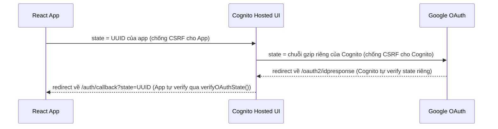
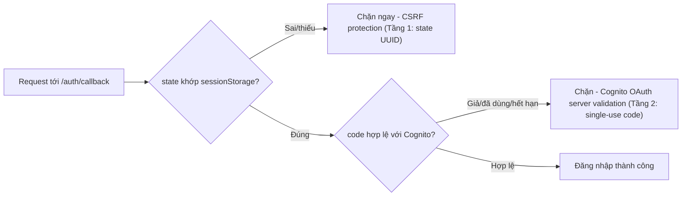

# BÀN GIAO - PRODUCTION HARDENING (CSRF + MONITORING + ENCRYPTION)

**Ngày:** 23/07/2026
**Người thực hiện:** L2NT
**Repo:** https://github.com/TakunKenjo/SmartdocAI-AWS

---

## 1. TỔNG QUAN

Triển khai 4 hạng mục production hardening đã thống nhất trong buổi review workshop
(bỏ S3 KMS và Rate limiting WAF vì chi phí/rủi ro không tương xứng với quy mô demo/thực tập
hiện tại — xem phần 5 để biết lý do chi tiết).

| # | Hạng mục | Loại thay đổi | Trạng thái |
|---|----------|----------------|------------|
| 1 | CloudWatch Alarms | AWS infra (SNS + 4 alarms) | ✅ Done |
| 2 | S3 Intelligent-Tiering | AWS infra (lifecycle rule) | ✅ Done |
| 3 | CSRF State Parameter | Code (Frontend) | ✅ Done |
| 4 | DynamoDB KMS Encryption | AWS infra | ✅ Done |

---

## 2. CHI TIẾT TỪNG HẠNG MỤC

### 2.1. CloudWatch Alarms

**Mục đích:** Chủ động phát hiện lỗi/hiệu năng bất thường thay vì chờ user report.

**Đã tạo:**
- **SNS Topic:** `arn:aws:sns:us-east-1:623035187993:smartdocai-alerts`
- **Email nhận cảnh báo:** `12345levan@gmail.com` (⚠️ cần xác nhận subscription qua email nếu chưa click link confirm)

**4 Alarms:**

| Alarm Name | Metric | Ngưỡng | Ý nghĩa |
|-----------|--------|--------|---------|
| `smartdocai-lambda-errors` | Lambda `Errors` | > 5 lỗi / 5 phút | Backend đang lỗi bất thường |
| `smartdocai-lambda-duration` | Lambda `Duration` | > 25000ms / 5 phút | Gần chạm timeout 30s (rủi ro user gặp lỗi) |
| `smartdocai-lambda-throttles` | Lambda `Throttles` | ≥ 1 lần / 5 phút | Vượt concurrency limit, cần tăng reserved concurrency |
| `smartdocai-apigateway-5xx` | API Gateway `5xxError` | > 5 lỗi / 5 phút | Lỗi server phía API Gateway/Lambda integration |

**Trạng thái hiện tại:** `INSUFFICIENT_DATA` (bình thường — sẽ chuyển `OK`/`ALARM` khi có đủ dữ liệu metric từ traffic thực tế).

**Verify:**
```bash
aws cloudwatch describe-alarms --alarm-name-prefix smartdocai --region us-east-1
```

---

### 2.2. S3 Intelligent-Tiering

**Mục đích:** Tự động chuyển object ít truy cập sang storage class rẻ hơn, giảm chi phí lưu trữ.

**Bucket:** `smartdocai-storage-623035187993`

**Cấu hình:** Lifecycle rule `IntelligentTieringRule` — transition mọi object sang `INTELLIGENT_TIERING` ngay khi upload (0 ngày).

**Lưu ý quan trọng:** AWS mặc định chỉ áp dụng transition cho object **≥ 128KB** (`TransitionDefaultMinimumObjectSize: all_storage_classes_128K`) để tránh chi phí monitoring vượt quá lợi ích tiết kiệm với file nhỏ. Phù hợp với tài liệu PDF/DOCX của SmartDocAI (thường lớn hơn 128KB).

**Verify:**
```bash
aws s3api get-bucket-lifecycle-configuration --bucket smartdocai-storage-623035187993 --region us-east-1
```

---

### 2.3. CSRF State Parameter (OAuth Login CSRF Protection)

**Lỗ hổng trước khi sửa:** Luồng Google Login qua Cognito Hosted UI không có tham số `state`, cho phép attacker dụ nạn nhân click 1 link chứa authorization code do attacker tạo sẵn — khiến nạn nhân vô tình đăng nhập vào tài khoản của attacker (Login CSRF / OAuth code injection).

**Files đã sửa:**

1. **`smart-docs-ai/smart-docs-ai/src/api/cognitoOAuth.js`**
   - `getGoogleLoginUrl()`: sinh `state = crypto.randomUUID()`, lưu vào `sessionStorage`, đính kèm vào URL redirect sang Cognito.
   - Thêm hàm mới `verifyOAuthState(returnedState)`: so sánh state trả về với state đã lưu, xóa sau khi dùng (chống replay).

2. **`smart-docs-ai/smart-docs-ai/src/features/auth/pages/GoogleCallbackPage.jsx`**
   - Đọc `state` từ query param khi Cognito redirect về `/auth/callback`.
   - Gọi `verifyOAuthState()` — nếu không khớp, từ chối luôn (không đổi code lấy token), điều hướng về `/login` kèm thông báo lỗi.

**Trạng thái:** ✅ Đã deploy production qua `smartdocsai-fe-pipeline` (Source → Build → Deploy đều Succeeded). CloudFront domain: `https://dutf3c70nnjzl.cloudfront.net`.

#### Luồng OAuth đầy đủ (2 lớp CSRF protection độc lập)



- **Tầng 1 (`state` UUID)** — do code tự tạo/verify, chặn tấn công "dụ click link CSRF" ở tầng ứng dụng.
- **Tầng 2 (`state` gzip nội bộ)** — do AWS Cognito tự quản lý cho round-trip riêng với Google, không cần can thiệp.

Ngoài ra hệ thống còn có **tầng bảo vệ thứ 2 độc lập** ở chính authorization `code` — Cognito chỉ chấp nhận code hợp lệ, chưa dùng, còn hạn (~vài phút), khiến kể cả khi `state` đúng nhưng `code` giả/đã dùng vẫn bị từ chối:



#### Cách test đã thực hiện (verify trên production)

**Test 1 — Login bình thường:** Mở tab ẩn danh tại CloudFront domain → đăng nhập Google → phải vào được `/app` bình thường. ✅ Pass.

**Test 2 — Verify `state` xuất hiện trong URL (xác nhận code mới đã chạy):**
Mở DevTools → Network → nhấn "Đăng nhập bằng Google" → tìm request redirect sang
`.../oauth2/authorize?...&state=<UUID>`. Đã quan sát được `state` dạng UUID hợp lệ
(ví dụ `state=36706f9d-61bb-48a3-8453-a65b86738e0f`) → xác nhận code CSRF đã deploy đúng. ✅ Pass.

**Test 3 — Giả lập tấn công CSRF (state sai):**
1. Bắt đầu login Google → khi ở màn hình chọn tài khoản, nhấn Back để quay lại app (sessionStorage `oauth_state` vẫn còn vì cùng tab/origin).
2. Mở DevTools → Application → Session Storage → copy giá trị `oauth_state` thật (ví dụ `0b124b7d-4120-45ae-9892-a5472293b931`).
3. Gõ thẳng vào thanh địa chỉ URL giả với `state` **khác** giá trị thật:
   ```
   https://dutf3c70nnjzl.cloudfront.net/auth/callback?code=test123&state=00000000-0000-0000-0000-000000000000
   ```
4. **Kết quả:** Bị chặn ngay ở Tầng 1 — redirect về `/login` kèm thông báo "Phiên đăng nhập Google không hợp lệ hoặc đã hết hạn. Vui lòng thử lại." ✅ Pass — không cần `code` thật vì bị chặn trước khi gọi tới Cognito.

**Test 4 — `state` đúng nhưng `code` giả (verify Tầng 2 hoạt động độc lập):**
Dùng lại đúng giá trị `oauth_state` thật đã copy ở Test 3:
```
https://dutf3c70nnjzl.cloudfront.net/auth/callback?code=test123&state=0b124b7d-4120-45ae-9892-a5472293b931
```
**Kết quả:** Qua được Tầng 1 (state khớp) nhưng bị Cognito từ chối ở Tầng 2 vì `code=test123`
không phải authorization code thật (invalid_grant) → báo lỗi "Đổi code lấy token thất bại: ...".
✅ Pass — chứng minh hệ thống có 2 lớp bảo vệ độc lập, không chỉ dựa vào `state`.

**Test 5 — Verify sessionStorage tự dọn dẹp:** Sau mỗi lần verify (đúng hoặc sai), key `oauth_state`
đều bị xóa khỏi sessionStorage (chống replay attack dùng lại state cũ). ✅ Pass.

---

### 2.4. DynamoDB KMS Encryption

**Mục đích:** Nâng cấp encryption at-rest từ AWS owned key (mặc định) sang Customer/AWS Managed Key (KMS) để có audit trail qua CloudTrail.

**Table:** `smartdocai-user-profiles`

**Trước:** `SSEDescription: null` (dùng AWS owned key, không audit được).

**Sau:**
```json
{
  "Status": "ENABLED",
  "SSEType": "KMS",
  "KMSMasterKeyArn": "arn:aws:kms:us-east-1:623035187993:key/e69d6e91-9c65-42f9-9b0b-2d53283f0dac"
}
```

**Key sử dụng:** `alias/aws/dynamodb` (AWS managed key — miễn phí, không cần tạo/quản lý Customer Managed Key riêng).

**Downtime:** Không có — table chuyển `UPDATING` → `ACTIVE` trong vài phút, không cần sửa IAM permission (Lambda role đã có quyền DynamoDB sẵn, managed key tự động cấp quyền tương ứng).

**Verify đã test:** Đọc thử `scan` sau khi bật KMS — hoạt động bình thường.

---

## 3. FILE THAY ĐỔI (GIT)

```
modified:   smart-docs-ai/smart-docs-ai/src/api/cognitoOAuth.js
modified:   smart-docs-ai/smart-docs-ai/src/features/auth/pages/GoogleCallbackPage.jsx
```

✅ Đã commit + push lên `main` (tác giả L2NT <12345levan@gmail.com>) → CodePipeline `smartdocsai-fe-pipeline` tự build/deploy thành công lúc 2026-07-23 11:29:27 +07:00.

---

## 4. VIỆC CẦN LÀM TIẾP (NEXT STEPS)

- [x] Xác nhận email `12345levan@gmail.com` đã confirm subscription SNS (đã confirm thành công)
- [x] Commit + push 2 file CSRF state lên `main` để deploy
- [x] Test lại luồng Google Login trên môi trường production sau khi deploy (Test 1-5, xem mục 2.3)
- [ ] Theo dõi 4 CloudWatch Alarms trong vài ngày đầu để tinh chỉnh ngưỡng nếu cần (ví dụ Duration threshold có thể cần điều chỉnh dựa trên traffic thực tế)
- [ ] Cập nhật Workshop section 5.1.4 (AWS services) và 5.6 (Next Steps) để phản ánh các thay đổi này

---

## 5. CÁC HẠNG MỤC ĐÃ CÂN NHẮC NHƯNG KHÔNG TRIỂN KHAI

| Hạng mục | Lý do không làm |
|----------|-----------------|
| **S3 KMS Encryption** | S3 đã tự động mã hóa SSE-S3 (AES-256) mặc định từ 2023, không cần cấu hình thêm. Nâng cấp lên KMS sẽ phát sinh chi phí API call trên mỗi lần đọc/ghi S3 (pipeline RAG đọc FAISS index rất thường xuyên), trong khi lợi ích tăng thêm (audit trail, key rotation) không cần thiết ở quy mô hiện tại. |
| **Rate Limiting (AWS WAF)** | Cognito đã có cơ chế throttling/progressive delay/account lockout built-in miễn phí. WAF tốn thêm ~$5-10/tháng, không tương xứng với quy mô demo/thực tập (vài chục user). Khuyến nghị bổ sung khi lên production với traffic lớn hơn. |
| **Cognito MFA** | Cần thêm UI component mới ở Frontend (màn hình nhập OTP) — độ ưu tiên thấp hơn so với 4 hạng mục đã làm, để triển khai ở giai đoạn sau. |

---

## 6. THÔNG TIN THAM KHẢO

**AWS Account:** 623035187993 | **Region:** us-east-1

**Resources liên quan:**
- SNS Topic: `smartdocai-alerts`
- Lambda: `smartdocai`
- API Gateway: `d60866voq5`
- S3 Bucket: `smartdocai-storage-623035187993`
- DynamoDB Table: `smartdocai-user-profiles`

**Liên hệ:** L2NT — 12345levan@gmail.com
