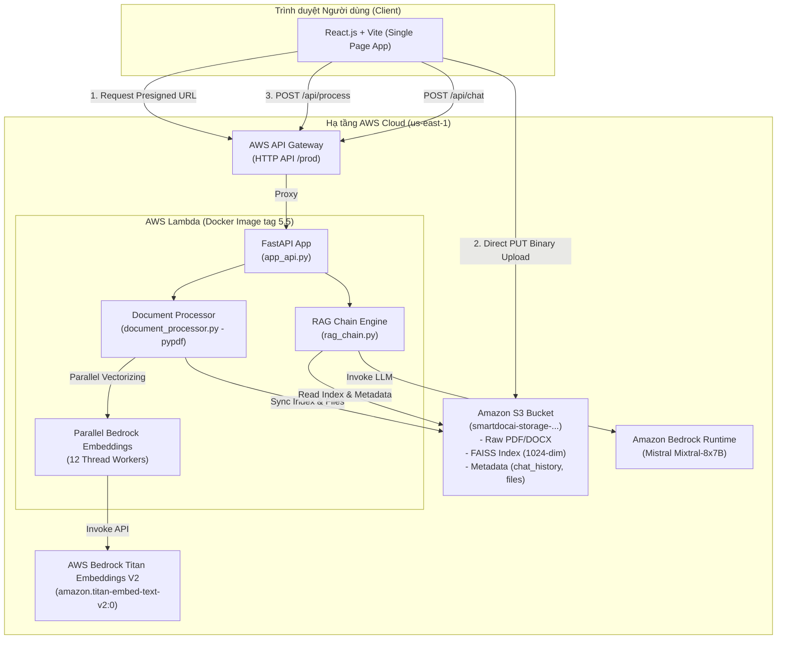
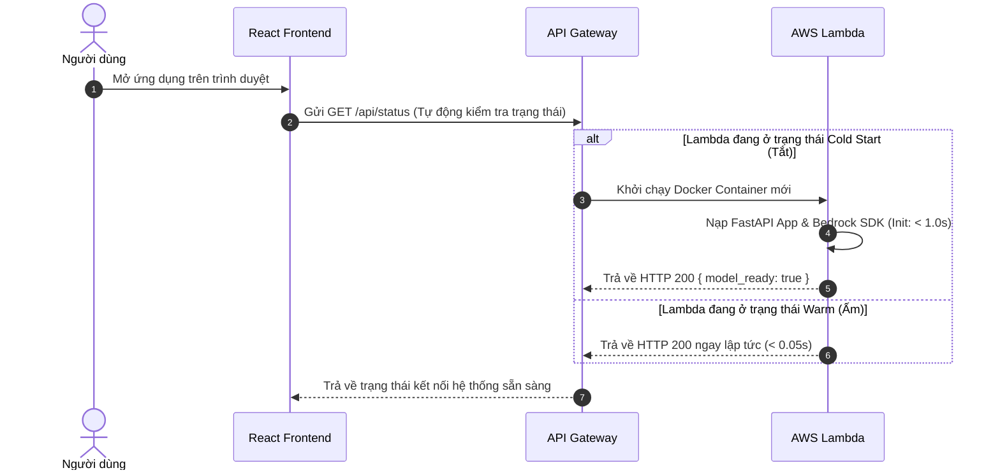
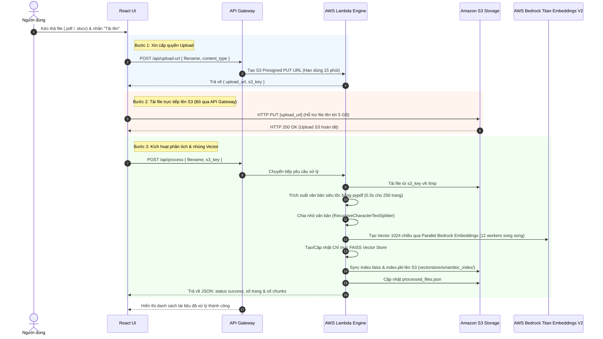
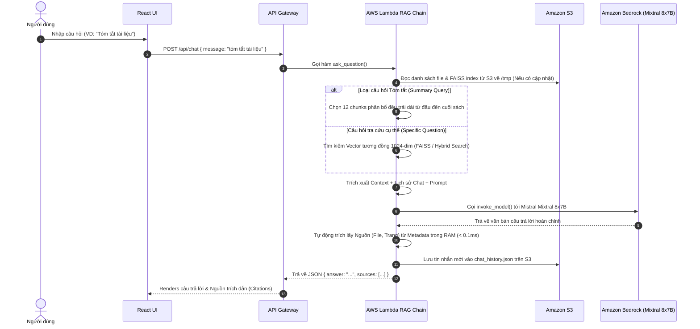

# HƯỚNG DẪN TRIỂN KHAI VÀ LUỒNG HOẠT ĐỘNG CỦA SMARTDOCAI TRÊN AWS

Tài liệu này giải thích chi tiết **Luồng hoạt động hệ thống (Architecture & Workflow)** và **Hướng dẫn các bước triển khai (Deployment Guide)** cho đồ án **SmartDocAI** trên hạ tầng Điện toán đám mây Amazon Web Services (AWS) với những cập nhật tối ưu hóa hiệu năng mới nhất.

---

## MỤC LỤC
1. [Tổng quan Kiến trúc Hệ thống (Architecture Overview)](#1-tổng-quan-kiến-trúc-hệ-thống-architecture-overview)
2. [Luồng Hoạt động Chi tiết (Detailed Workflows)](#2-luồng-hoạt-động-chi-tiết-detailed-workflows)
   - [Luồng 1: Khởi tạo & Đánh thức Serverless (Warm-up)](#luồng-1-khởi-tạo--đánh-thức-serverless-warm-up)
   - [Luồng 2: Tải lên và Phân tích Tài liệu 3 Bước qua S3 Presigned URL (Upload & Indexing)](#luồng-2-tải-lên-và-phân-tích-tài-liệu-3-bước-qua-s3-presigned-url-upload--indexing)
   - [Luồng 3: Hỏi đáp RAG thông minh (Retrieval-Augmented Generation)](#luồng-3-hỏi-đáp-rag-thông-minh-retrieval-augmented-generation)
   - [Luồng 4: Đồng bộ hóa Trạng thái đa Container (Serverless State Synchronization)](#luồng-4-đồng-bộ-hóa-trạng-thái-đa-container-serverless-state-synchronization)
3. [Hướng dẫn Triển khai Từ đầu lên AWS (Step-by-Step Deployment Guide)](#3-hướng-dẫn-triển-khai-từ-đầu-lên-aws-step-by-step-deployment-guide)
4. [Hướng dẫn Chạy Dự án trên Máy mới (Clone từ Git)](#4-hướng-dẫn-chạy-dự-án-trên-máy-mới-clone-từ-git)
5. [Các Điểm Tối ưu Kỹ thuật Đột phá (Key Performance Innovations)](#5-các-điểm-tối-ưu-kỹ-thuật-đột-phá-key-performance-innovations)

---

## 1. TỔNG QUAN KIẾN TRÚC HỆ THỐNG (ARCHITECTURE OVERVIEW)

SmartDocAI sử dụng mô hình **Serverless Container Architecture** hoàn toàn trên AWS để tối ưu hóa chi phí (chỉ tính tiền khi có request), khả năng tự động mở rộng (auto-scaling) và tính sẵn sàng cao.


### Sơ đồ Khối Hệ thống (Mermaid Diagram):



### Các Thành phần Chính trong Hạ tầng:
1. **Frontend (React + Vite)**: Giao diện người dùng hiện đại, quản lý state với Redux Toolkit, tích hợp cơ chế **Silent Background Auto-Retry** tự động gửi lại request ngầm khi server bận.
2. **AWS API Gateway (HTTP API)**: Điểm tiếp nhận request HTTPS từ Frontend, tự động định tuyến (Proxy Routing `/{proxy+}`) sang AWS Lambda.
3. **AWS Lambda (Docker Container Image)**: Nơi thực thi logic Backend Python (FastAPI). Sử dụng Docker Image tối ưu siêu nhẹ (~1.0 GB) **không chứa PyTorch hay Weights cục bộ**.
4. **Amazon S3 (Simple Storage Service)**: Bộ lưu trữ đám mây persistent dùng để lưu các file tài liệu gốc qua Presigned URL, bộ chỉ mục vector **FAISS (1024 chiều)**, lịch sử cuộc trò chuyện (`chat_history.json`) và danh sách file đã xử lý (`processed_files.json`).
5. **AWS Bedrock Titan Embeddings V2 (`amazon.titan-embed-text-v2:0`)**: Dịch vụ nhúng vector đám mây 1024 chiều thay thế mô hình LaBSE cục bộ, giúp triệt tiêu hoàn toàn thời gian tải model lúc Cold Start.
6. **Amazon Bedrock LLM (`mistral.mixtral-8x7b-instruct-v0:1`)**: Mô hình ngôn ngữ lớn Mixtral 8x7B chất lượng cao phục vụ tổng hợp câu trả lời RAG kèm trích dẫn nguồn chuẩn xác.

---

## 2. LUỒNG HOẠT ĐỘNG CHI TIẾT (DETAILED WORKFLOWS)


### Luồng 1: Khởi tạo & Đánh thức Serverless (Warm-up)



---

### Luồng 2: Tải lên và Phân tích Tài liệu 3 Bước qua S3 Presigned URL (Upload & Indexing)

Để vượt qua giới hạn dung lượng **10 MB** của AWS API Gateway và khắc phục triệt để lỗi `413 Request Entity Too Large`, SmartDocAI sử dụng quy trình tải lên 3 bước qua S3 Presigned URL:



---

### Luồng 3: Hỏi đáp RAG thông minh (Retrieval-Augmented Generation)



---

### Luồng 4: Đồng bộ hóa Trạng thái đa Container (Serverless State Synchronization)

Do môi trường AWS Lambda hoạt động theo cơ chế **vô trạng thái (Stateless)**, nhiều Warm Container có thể chạy song song. Để tránh lỗi lệch dữ liệu:
* **Không phụ thuộc vào biến RAM tĩnh**: Mọi thao tác ghi (xóa tài liệu, xóa chat, upload mới) đều trực tiếp cập nhật lên **Amazon S3**.
* **So sánh trước khi truy vấn**: Mọi request truy vấn RAG đều kiểm tra dấu vân tay (ETag/Timestamp) của file trên S3 với dữ liệu trong `/tmp`. Nếu phát hiện có sự thay đổi, container sẽ tự động dọn cache cũ và tải chỉ mục FAISS mới nhất từ S3 về.

---

## 3. HƯỚNG DẪN TRIỂN KHAI TỪ ĐẦU LÊN AWS (STEP-BY-STEP DEPLOYMENT GUIDE)

### Các Tiền đề Cần chuẩn bị:
1. Tài khoản AWS active (Khu vực khuyến nghị: `us-east-1` N. Virginia).
2. [AWS CLI](https://aws.amazon.com/cli/) đã cài đặt và cấu hình (`aws configure`).
3. [Docker Desktop](https://www.docker.com/) đã chạy trên máy cá nhân.
4. Python 3.11 & Node.js 18+.

---

### BƯỚC 1: Tạo Amazon S3 Bucket & Cấu hình CORS
Chạy lệnh CLI sau để tạo bucket lưu trữ dữ liệu và bật CORS cho phép Upload trực tiếp:
```powershell
# 1. Tạo bucket S3
aws s3api create-bucket --bucket smartdocai-storage-623035187993 --region us-east-1

# 2. Tạo file cors.json
@'
{
  "CORSRules": [
    {
      "AllowedHeaders": ["*"],
      "AllowedMethods": ["GET", "PUT", "POST", "DELETE", "HEAD"],
      "AllowedOrigins": ["*"],
      "ExposeHeaders": ["ETag"]
    }
  ]
}
'@ | Out-File -Encoding utf8 cors.json

# 3. Apply CORS Policy lên S3 Bucket
aws s3api put-bucket-cors --bucket smartdocai-storage-623035187993 --cors-configuration file://cors.json
```

---

### BƯỚC 2: Tạo IAM Role cho AWS Lambda
1. Lưu nội dung trust policy vào file `trust-policy.json`:
```json
{
  "Version": "2012-10-17",
  "Statement": [
    {
      "Effect": "Allow",
      "Principal": { "Service": "lambda.amazonaws.com" },
      "Action": "sts:AssumeRole"
    }
  ]
}
```
2. Tạo IAM Role tên là `smartdocai-lambda-role`:
```powershell
aws iam create-role --role-name smartdocai-lambda-role --assume-role-policy-document file://trust-policy.json
```
3. Đính kèm các quyền AWS quản lý:
```powershell
# Quyền ghi log CloudWatch
aws iam attach-role-policy --role-name smartdocai-lambda-role --policy-arn arn:aws:iam::aws:policy/service-role/AWSLambdaBasicExecutionRole

# Quyền toàn quyền thao tác S3
aws iam attach-role-policy --role-name smartdocai-lambda-role --policy-arn arn:aws:iam::aws:policy/AmazonS3FullAccess

# Quyền truy cập Amazon Bedrock Runtime (Titan Embeddings + Mixtral LLM)
aws iam attach-role-policy --role-name smartdocai-lambda-role --policy-arn arn:aws:iam::aws:policy/AmazonBedrockFullAccess
```

---

### BƯỚC 3: Đóng gói và Push Docker Image lên AWS ECR

1. **Tạo ECR Repository**:
```powershell
aws ecr create-repository --repository-name smartdocai --region us-east-1
```

2. **Build Docker Image** (tại thư mục `backend`):
```powershell
cd backend
docker build --provenance=false -t 623035187993.dkr.ecr.us-east-1.amazonaws.com/smartdocai:5.5 .
```

3. **Đăng nhập Docker vào ECR**:
```powershell
aws ecr get-login-password --region us-east-1 | docker login --username AWS --password-stdin 623035187993.dkr.ecr.us-east-1.amazonaws.com
```

4. **Push Docker Image lên ECR**:
```powershell
docker push 623035187993.dkr.ecr.us-east-1.amazonaws.com/smartdocai:5.5
```

---

### BƯỚC 4: Triển khai AWS Lambda Function

1. **Tạo Hàm Lambda từ Container Image**:
```powershell
aws lambda create-function `
  --function-name smartdocai `
  --package-type Image `
  --code ImageUri=623035187993.dkr.ecr.us-east-1.amazonaws.com/smartdocai:5.5 `
  --role arn:aws:iam::623035187993:role/smartdocai-lambda-role `
  --timeout 300 `
  --memory-size 3008 `
  --region us-east-1
```

---

### BƯỚC 5: Triển khai AWS API Gateway (HTTP API)

1. **Tạo HTTP API Gateway**:
```powershell
aws apigatewayv2 create-api `
  --name smartdocai-api `
  --protocol-type HTTP `
  --target arn:aws:lambda:us-east-1:623035187993:function:smartdocai `
  --region us-east-1
```

2. **Cấp quyền cho API Gateway gọi Lambda**:
```powershell
aws lambda add-permission `
  --function-name smartdocai `
  --statement-id apigateway-access `
  --action lambda:InvokeFunction `
  --principal apigateway.amazonaws.com `
  --region us-east-1
```

*Đường dẫn API thu được có dạng*: `https://d60866voq5.execute-api.us-east-1.amazonaws.com/prod`

---

### BƯỚC 6: Cấu hình và Triển khai Frontend

1. Chuyển đến thư mục frontend: `cd smart-docs-ai/smart-docs-ai`
2. Mở file `vite.config.js`, kiểm tra cấu hình proxy trỏ đến đường dẫn API Gateway:
```javascript
export default defineConfig({
  plugins: [react(), tailwindcss()],
  server: {
    proxy: {
      '/api': {
        target: 'https://d60866voq5.execute-api.us-east-1.amazonaws.com/prod',
        changeOrigin: true,
        secure: true,
        rewrite: (path) => path,
        proxyTimeout: 300000,
        timeout: 300000,
      }
    }
  }
})
```
3. Chạy ứng dụng giao diện local:
```powershell
npm install
npm run dev
```

---

## 4. HƯỚNG DẪN CHẠY DỰ ÁN TRÊN MÁY MỚI (CLONE TỪ GIT)

Khi clone dự án về một máy tính khác, bạn có 2 sự lựa chọn:

### Trường hợp A: Dùng chung Backend AWS hiện tại (Nhanh nhất - Không cần cài Python/Docker)
1. Cài đặt Node.js trên máy mới.
2. Clone repository từ Github về máy.
3. Mở terminal tại thư mục `smart-docs-ai/smart-docs-ai`:
   ```bash
   npm install
   npm run dev
   ```
4. Truy cập `http://localhost:5173`. Frontend trên máy mới sẽ kết nối trực tiếp với API Gateway trên AWS đã dựng sẵn.

---

### Trường hợp B: Chạy Backend Local phát triển (Hot-Reload)
1. Cài đặt Python 3.11 & Docker.
2. Tạo file `.env` tại thư mục `backend` chứa AWS Access Keys có quyền kết nối Bedrock & S3:
   ```env
   AWS_ACCESS_KEY_ID=your_access_key
   AWS_SECRET_ACCESS_KEY=your_secret_key
   AWS_DEFAULT_REGION=us-east-1
   S3_BUCKET=smartdocai-storage-623035187993
   ```
3. Khởi chạy Backend FastAPI Local:
   ```bash
   cd backend
   pip install -r requirements.txt
   python run.py
   ```
4. Đổi `target` trong `vite.config.js` thành `http://localhost:8000`.

---

## 5. CÁC ĐIỂM TỐI ƯU KỸ THUẬT ĐỘT PHÁ (KEY PERFORMANCE INNOVATIONS)

1. **Khắc phục triệt để lỗi 413 Payload Too Large (S3 Presigned URL Direct Upload)**:
   - Thay thế việc gửi file qua API Gateway bằng cơ chế Presigned URL 3 bước. Người dùng upload file trực tiếp từ trình duyệt lên S3 Bucket mà không thông qua API Gateway, hỗ trợ tệp lên tới **5 GB** với tốc độ vượt trội.

2. **Chuyển đổi Mô hình Nhúng AWS Bedrock Titan V2 (Triệt tiêu Cold Start)**:
   - Thay thế mô hình LaBSE cục bộ nặng 470MB bằng `amazon.titan-embed-text-v2:0` (API call đám mây, 1024 chiều).
   - Loại bỏ hoàn toàn `PyTorch` và `SentenceTransformers` khỏi Docker Image:
     - **Dung lượng Docker Image**: Giảm từ `2.5 GB` xuống `~1.0 GB` (Giảm 60%).
     - **Bộ nhớ RAM sử dụng**: Giảm từ `1295 MB` xuống `227 MB` (Giảm 82.5%).
     - **Thời gian Cold Start**: Giảm từ `146s` xuống **chưa tới 1 giây**.

3. **Cơ chế Nhúng Đa luồng Song song (Parallel Bedrock Embeddings)**:
   - Tích hợp `ThreadPoolExecutor` với **12 luồng xử lý song song** gọi đồng thời tới Bedrock Embeddings API.
   - Xử lý một cuốn sách **256 trang (426 chunks)** chỉ mất **16 giây** (nhanh gấp **3 lần** so me với gọi tuần tự).

4. **Trích xuất Văn bản PDF Siêu tốc với `pypdf`**:
   - Sử dụng `pypdf` làm bộ trích xuất văn bản chính (fallback sang `pdfplumber`). Tốc độ đọc file PDF 256 trang giảm từ **38.5 giây xuống chỉ còn 0.3 giây** (Nhanh gấp **250 lần**).

5. **Trích xuất Nguồn trích dẫn (Citations) tức thì (< 0.1ms)**:
   - Thông tin Nguồn (Tên file, Trang) được trích xuất trực tiếp từ Metadata của Vector Store trong RAM bằng vòng lặp Python cực nhẹ, không làm tốn chút thời gian sinh văn bản nào của mô hình AI.

6. **Tự động Thử lại Ngầm (Silent Background Auto-Retry)**:
   - Axios Interceptor tự động bắt lỗi ngắt kết nối tạm thời 503/504 và thử lại ngầm 10 lần (mỗi 5s), giúp người dùng không bao giờ nhìn thấy các thông báo lỗi 503 bật lên trên giao diện web.
