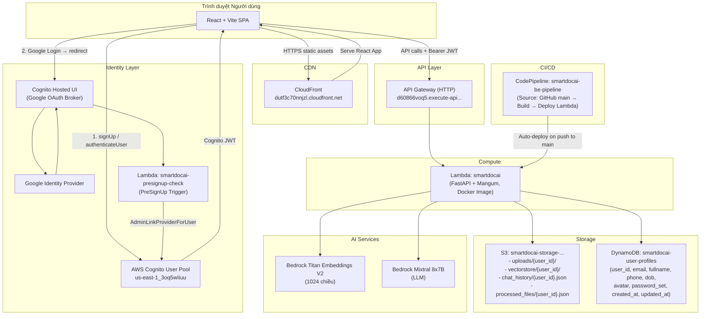
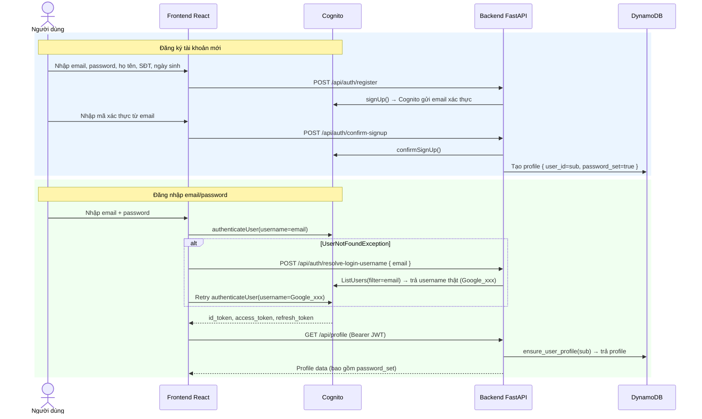
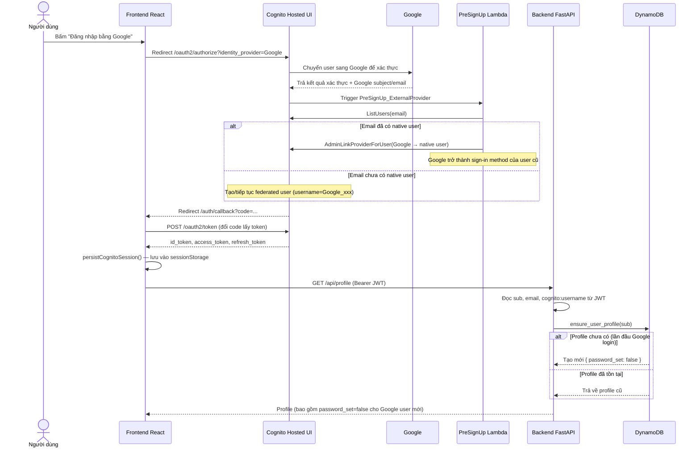
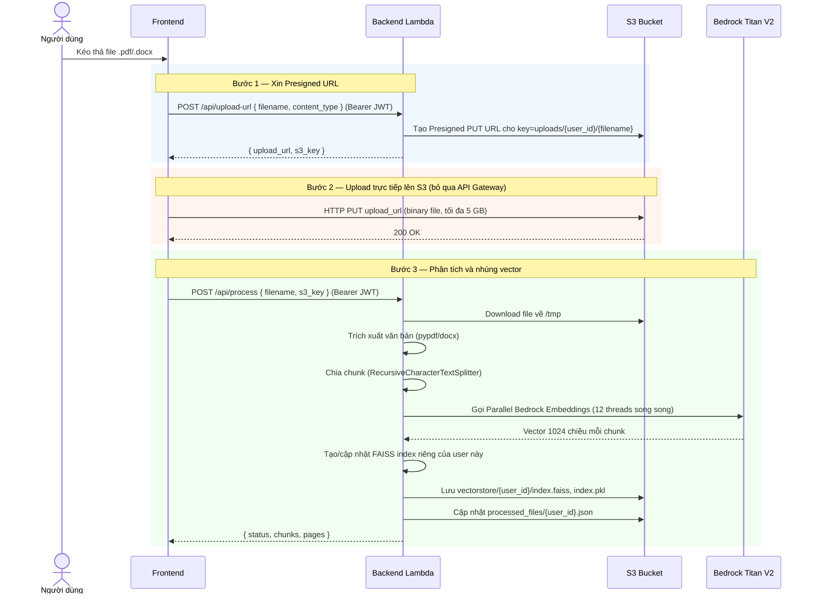
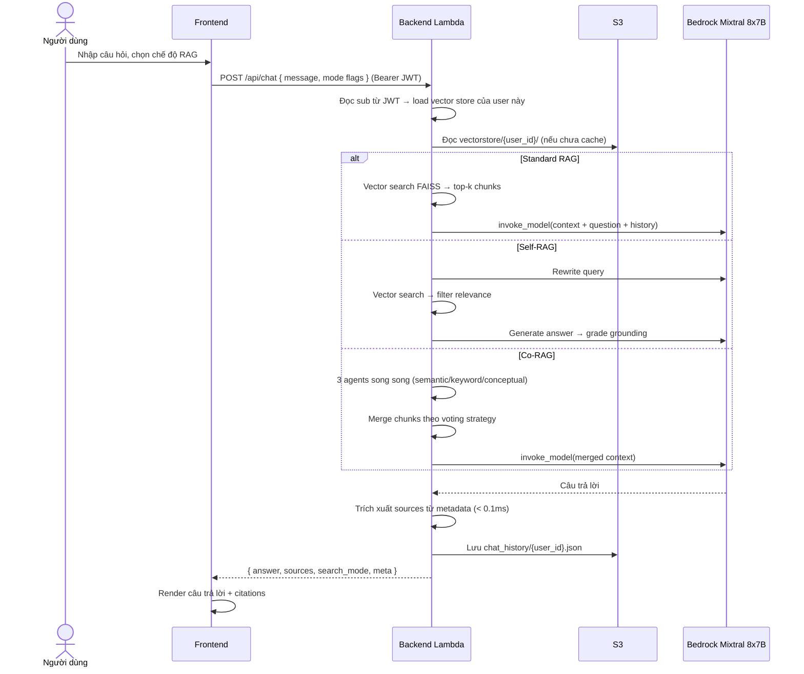
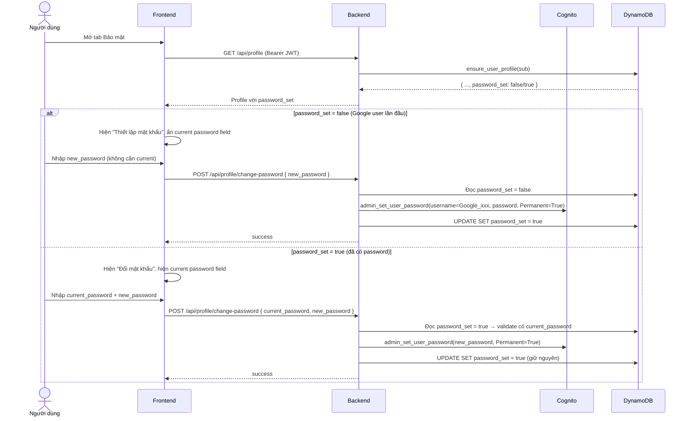

# HƯỚNG DẪN TRIỂN KHAI VÀ LUỒNG HOẠT ĐỘNG CỦA SMARTDOCAI TRÊN AWS

Tài liệu mô tả **kiến trúc hệ thống**, **luồng hoạt động chi tiết** và **hướng dẫn triển khai** cho đồ án **SmartDocAI** trên hạ tầng AWS.

> **Cập nhật lần cuối:** 2026-07-21 — bổ sung Cognito Authentication, Google OAuth + AdminLink, CloudFront, DynamoDB, CodePipeline CI/CD, Per-User Isolation, Self-RAG, Co-RAG.

---

## MỤC LỤC

1. [Tổng quan Kiến trúc Hệ thống](#1-tổng-quan-kiến-trúc-hệ-thống)
2. [Luồng Hoạt động Chi tiết](#2-luồng-hoạt-động-chi-tiết)
   - [Luồng 1: Đăng ký và Đăng nhập Email/Password](#luồng-1-đăng-ký-và-đăng-nhập-emailpassword)
   - [Luồng 2: Đăng nhập Google OAuth (Cognito Hosted UI + AdminLink)](#luồng-2-đăng-nhập-google-oauth-cognito-hosted-ui--adminlink)
   - [Luồng 3: Tải lên và Phân tích Tài liệu](#luồng-3-tải-lên-và-phân-tích-tài-liệu)
   - [Luồng 4: Hỏi đáp RAG (Standard / Self-RAG / Co-RAG)](#luồng-4-hỏi-đáp-rag-standard--self-rag--co-rag)
   - [Luồng 5: Quản lý Profile và Đổi Mật khẩu](#luồng-5-quản-lý-profile-và-đổi-mật-khẩu)
3. [Hướng dẫn Triển khai Từ đầu lên AWS](#3-hướng-dẫn-triển-khai-từ-đầu-lên-aws)
4. [CI/CD với AWS CodePipeline (Triển khai tự động)](#4-cicd-với-aws-codepipeline-triển-khai-tự-động)
5. [Hướng dẫn Chạy Local (Clone từ Git)](#5-hướng-dẫn-chạy-local-clone-từ-git)
6. [Các Điểm Tối ưu Kỹ thuật](#6-các-điểm-tối-ưu-kỹ-thuật)

---

## 1. TỔNG QUAN KIẾN TRÚC HỆ THỐNG

SmartDocAI sử dụng mô hình **Serverless Container Architecture** kết hợp **Managed Identity (Cognito)** trên AWS.

### Các Thành phần Hạ tầng Hiện tại

| Thành phần | Dịch vụ AWS | Giá trị cụ thể |
|---|---|---|
| Frontend hosting | CloudFront | `https://dutf3c70nnjzl.cloudfront.net` |
| Backend API | Lambda + API Gateway | `https://d60866voq5.execute-api.us-east-1.amazonaws.com/prod` |
| Xác thực | Cognito User Pool | `us-east-1_3oq5wIiuu` |
| Cognito App Client | Cognito | `63f74h4dj78kqihhoimv4acl8a` |
| Cognito Hosted UI | Cognito | `https://smartdocai-fayrun2026.auth.us-east-1.amazoncognito.com` |
| PreSignUp trigger | Lambda | `smartdocai-presignup-check` |
| Profile database | DynamoDB | `smartdocai-user-profiles` |
| File & Index storage | S3 | `smartdocai-storage-623035187993` |
| LLM | Bedrock | `mistral.mixtral-8x7b-instruct-v0:1` |
| Embeddings | Bedrock | `amazon.titan-embed-text-v2:0` (1024 chiều) |
| CI/CD | CodePipeline | `smartdocai-be-pipeline` (trigger từ nhánh `main`) |

### Sơ đồ Kiến trúc



### DynamoDB Profile Schema (hiện tại)

Các field được lưu trong `smartdocai-user-profiles` (partition key: `user_id = Cognito sub`):

| Field | Type | Mô tả |
|---|---|---|
| `user_id` | String | Cognito `sub` — khóa chính |
| `email` | String | Email hiển thị |
| `fullname` | String | Họ tên |
| `phone` | String | Số điện thoại (E.164) |
| `dob` | String | Ngày sinh (YYYY-MM-DD) |
| `avatar` | String/null | Base64 nếu < 300KB |
| `avatar_url` | String/null | S3 URL nếu ≥ 300KB |
| `password_set` | Boolean | `true` nếu đã từng set password native; `false` nếu Google-only chưa set |
| `created_at` | Number | Unix timestamp |
| `updated_at` | Number | Unix timestamp |

> **Lưu ý:** `password_set` vắng mặt ở user cũ được xử lý bằng `default=True` (an toàn).

---

## 2. LUỒNG HOẠT ĐỘNG CHI TIẾT

### Luồng 1: Đăng ký và Đăng nhập Email/Password



---

### Luồng 2: Đăng nhập Google OAuth (Cognito Hosted UI + AdminLink)

**Vấn đề giải quyết:** Cognito không tự merge native user và Google federated user dù cùng email. Nếu không xử lý, một người có thể có 2 Cognito sub khác nhau → 2 profile/dữ liệu khác nhau trong app.

**Giải pháp:** PreSignUp Lambda dùng `AdminLinkProviderForUser` để link Google vào native user đã tồn tại.



**Lý do `cognito:username` có dạng `Google_abcd`:**
Cognito tự ghép tên provider (`Google`) với subject ID mà Google trả về. Email vẫn nằm trong JWT claim `email`, nhưng `cognito:username` thật là `Google_...` — backend phải dùng `cognito:username` (không phải email) khi gọi Cognito Admin API.

---

### Luồng 3: Tải lên và Phân tích Tài liệu

SmartDocAI dùng **S3 Presigned URL 3 bước** để vượt giới hạn 10 MB của API Gateway và hỗ trợ file tới 5 GB. Mọi tài liệu và vector index được lưu **per-user** theo `user_id` (Cognito sub).



---

### Luồng 4: Hỏi đáp RAG (Standard / Self-RAG / Co-RAG)

SmartDocAI hỗ trợ 3 chế độ RAG có thể chuyển đổi trên UI:

| Chế độ | Mô tả |
|---|---|
| **Standard RAG** | Vector search → Mixtral → trả lời kèm sources |
| **Self-RAG** | Rewrite query → filter relevance → grade answer → hallucination check |
| **Co-RAG (Multi-Agent)** | 3 agent (semantic / keyword / conceptual) song song → merge kết quả theo voting |



---

### Luồng 5: Quản lý Profile và Đổi Mật khẩu

#### Logic `password_set`

| Trạng thái | Ai | Hành vi UI | Backend |
|---|---|---|---|
| `password_set = false` | Google user mới | Ẩn current password, button "Thiết lập mật khẩu" | `admin_set_user_password` không cần verify |
| `password_set = true` | Tất cả user đã có password | Hiện current password, button "Đổi mật khẩu" | Bắt buộc `current_password` |
| Field vắng mặt (user cũ) | Native user cũ | Coi là `true` (an toàn) | Bắt buộc `current_password` |



---

## 3. HƯỚNG DẪN TRIỂN KHAI TỪ ĐẦU LÊN AWS

> Hệ thống hiện tại đã được triển khai. Phần này dành cho trường hợp cần deploy lại từ đầu.

### Điều kiện tiên quyết

- Tài khoản AWS (`us-east-1`)
- AWS CLI đã cấu hình (`aws configure`)
- Docker Desktop đang chạy
- Python 3.11+, Node.js 18+
- GitHub repository đã có code

---

### BƯỚC 1: Tạo S3 Bucket và cấu hình CORS

```powershell
aws s3api create-bucket --bucket smartdocai-storage-623035187993 --region us-east-1
aws s3api put-bucket-cors --bucket smartdocai-storage-623035187993 --cors-configuration file://backend/cors.json
```

---

### BƯỚC 2: Tạo DynamoDB Table

```powershell
aws dynamodb create-table `
  --table-name smartdocai-user-profiles `
  --attribute-definitions AttributeName=user_id,AttributeType=S `
  --key-schema AttributeName=user_id,KeyType=HASH `
  --billing-mode PAY_PER_REQUEST `
  --region us-east-1
```

---

### BƯỚC 3: Tạo Cognito User Pool

```powershell
aws cognito-idp create-user-pool `
  --pool-name smartdocai-user-pool `
  --auto-verified-attributes email `
  --username-attributes email `
  --region us-east-1
```

Sau khi tạo, vào AWS Console để:
- Thêm Google như một Identity Provider (cần Google OAuth Client ID/Secret)
- Tạo App Client `ReactAppClient` với Hosted UI, OAuth 2.0 flows: `code`
- Thêm Allowed callback URLs:
  - `http://localhost:5173/auth/callback`
  - `http://localhost:5174/auth/callback`
  - `https://dutf3c70nnjzl.cloudfront.net/auth/callback`
- Thêm Allowed sign-out URLs:
  - `http://localhost:5173/login`
  - `https://dutf3c70nnjzl.cloudfront.net/login`

---

### BƯỚC 4: Tạo và Deploy PreSignUp Lambda

```powershell
# Tạo IAM Role cho PreSignUp Lambda
aws iam create-role `
  --role-name smartdocai-presignup-role `
  --assume-role-policy-document file://trust-policy.json

aws iam attach-role-policy `
  --role-name smartdocai-presignup-role `
  --policy-arn arn:aws:iam::aws:policy/service-role/AWSLambdaBasicExecutionRole

# Thêm inline policy cho ListUsers + AdminLinkProviderForUser
aws iam put-role-policy `
  --role-name smartdocai-presignup-role `
  --policy-name AllowCognitoLinkForUser `
  --policy-document '{
    "Version":"2012-10-17",
    "Statement":[{
      "Effect":"Allow",
      "Action":["cognito-idp:ListUsers","cognito-idp:AdminLinkProviderForUser"],
      "Resource":"arn:aws:iam::623035187993:*"
    }]
  }'

# Deploy Lambda từ source (backend/lambdas/presignup_check/)
# Zip và upload, sau đó set trigger trong Cognito Console:
# User Pool → User pool properties → Add Lambda trigger → Pre sign-up → smartdocai-presignup-check
```

---

### BƯỚC 5: Tạo IAM Role cho Lambda Backend

```powershell
aws iam create-role `
  --role-name smartdocai-lambda-role `
  --assume-role-policy-document file://trust-policy.json

aws iam attach-role-policy --role-name smartdocai-lambda-role --policy-arn arn:aws:iam::aws:policy/service-role/AWSLambdaBasicExecutionRole
aws iam attach-role-policy --role-name smartdocai-lambda-role --policy-arn arn:aws:iam::aws:policy/AmazonS3FullAccess
aws iam attach-role-policy --role-name smartdocai-lambda-role --policy-arn arn:aws:iam::aws:policy/AmazonBedrockFullAccess
aws iam attach-role-policy --role-name smartdocai-lambda-role --policy-arn arn:aws:iam::aws:policy/AmazonDynamoDBFullAccess
```

---

### BƯỚC 6: Tạo ECR Repository

```powershell
aws ecr create-repository --repository-name smartdocai --region us-east-1
```

---

### BƯỚC 7: Build và Push Docker Image thủ công (lần đầu)

```powershell
cd backend
docker build --provenance=false -t 623035187993.dkr.ecr.us-east-1.amazonaws.com/smartdocai:latest .
aws ecr get-login-password --region us-east-1 | docker login --username AWS --password-stdin 623035187993.dkr.ecr.us-east-1.amazonaws.com
docker push 623035187993.dkr.ecr.us-east-1.amazonaws.com/smartdocai:latest
```

---

### BƯỚC 8: Tạo Lambda Function

```powershell
aws lambda create-function `
  --function-name smartdocai `
  --package-type Image `
  --code ImageUri=623035187993.dkr.ecr.us-east-1.amazonaws.com/smartdocai:latest `
  --role arn:aws:iam::623035187993:role/smartdocai-lambda-role `
  --timeout 300 `
  --memory-size 3008 `
  --region us-east-1
```

Thêm environment variables qua Console hoặc CLI:

```powershell
aws lambda update-function-configuration `
  --function-name smartdocai `
  --environment "Variables={S3_BUCKET=smartdocai-storage-623035187993,AWS_DEFAULT_REGION=us-east-1,COGNITO_USERPOOL_ID=us-east-1_3oq5wIiuu}"
```

---

### BƯỚC 9: Tạo API Gateway

```powershell
aws apigatewayv2 create-api `
  --name smartdocai-api `
  --protocol-type HTTP `
  --target arn:aws:lambda:us-east-1:623035187993:function:smartdocai `
  --region us-east-1

aws lambda add-permission `
  --function-name smartdocai `
  --statement-id apigateway-access `
  --action lambda:InvokeFunction `
  --principal apigateway.amazonaws.com `
  --region us-east-1
```

---

### BƯỚC 10: Build và Deploy Frontend lên CloudFront

```powershell
cd smart-docs-ai/smart-docs-ai
npm install
npm run build
# Upload dist/ lên S3 bucket frontend, sau đó tạo CloudFront distribution trỏ về bucket đó
aws s3 sync dist/ s3://smartdocai-frontend-bucket/ --delete
aws cloudfront create-invalidation --distribution-id <DISTRIBUTION_ID> --paths "/*"
```

---

## 4. CI/CD VỚI AWS CODEPIPELINE (TRIỂN KHAI TỰ ĐỘNG)

Hiện tại backend được deploy **tự động** khi push lên nhánh `main`.

### Quy trình CI/CD

```
Push to GitHub main
    → CodePipeline: smartdocai-be-pipeline
        → Stage Source: lấy code từ GitHub
        → Stage Build: CodeBuild chạy docker build + push ECR
        → Stage Deploy: cập nhật Lambda function với image mới
```

### Quy tắc nhánh

| Nhánh | Mục đích |
|---|---|
| `main` | Production — CodePipeline theo dõi, push = auto-deploy |
| `phuc-google-login` | Nhánh phát triển cá nhân (feature/fix) |

### Khi muốn deploy tính năng mới

```powershell
# 1. Commit code trên nhánh feature
git add .
git commit -m "feat: mô tả tính năng"
git push origin phuc-google-login  # hoặc tên nhánh của bạn

# 2. Merge vào main để trigger pipeline
git checkout main
git pull origin main
git merge phuc-google-login
git push origin main

# 3. Theo dõi trên AWS Console → CodePipeline → smartdocai-be-pipeline
# Khi "Deploy" stage = Succeeded → Lambda đã chạy code mới
```

---

## 5. HƯỚNG DẪN CHẠY LOCAL (CLONE TỪ GIT)

### Trường hợp A: Chỉ chạy Frontend (kết nối Backend AWS sẵn có)

```powershell
git clone <repo_url>
cd smart-docs-ai/smart-docs-ai
npm install
npm run dev
# Truy cập http://localhost:5173
# Frontend tự động proxy /api → API Gateway AWS (cấu hình sẵn trong vite.config.js)
```

### Trường hợp B: Chạy Backend Local

Tạo file `backend/.env`:

```env
AWS_ACCESS_KEY_ID=your_access_key
AWS_SECRET_ACCESS_KEY=your_secret_key
AWS_DEFAULT_REGION=us-east-1
S3_BUCKET=smartdocai-storage-623035187993
COGNITO_USERPOOL_ID=us-east-1_3oq5wIiuu
```

Chạy backend:

```powershell
cd backend
pip install -r requirements.txt
python run.py
# Backend chạy tại http://localhost:8000
```

Đổi proxy trong `vite.config.js`:

```javascript
proxy: {
  '/api': {
    target: 'http://localhost:8000',
    changeOrigin: true,
  }
}
```

---

## 6. CÁC ĐIỂM TỐI ƯU KỸ THUẬT

### 6.1 Kiến trúc xác thực an toàn (Cognito + AdminLink)

- **Vấn đề:** Cognito không tự merge native user và Google user dù cùng email → duplicate `sub` → duplicate profile/data.
- **Giải pháp:** PreSignUp Lambda kiểm tra email, gọi `AdminLinkProviderForUser` để link Google vào native user trước khi Cognito tạo federated identity mới.
- **Kết quả:** Một người dùng luôn có đúng một Cognito `sub`, bất kể đăng nhập bằng phương thức nào.

### 6.2 Phân tách 3 định danh trong token

Backend tách rõ 3 giá trị từ Cognito JWT:

| Claim | Dùng cho | Ví dụ |
|---|---|---|
| `sub` | `user_id` trong app (DynamoDB key, S3 path, FAISS path) | `94d80488-...` |
| `email` | Hiển thị, liên hệ | `user@example.com` |
| `cognito:username` | Gọi Cognito Admin API | `user@example.com` hoặc `Google_100697...` |

### 6.3 Per-User Data Isolation

Mọi dữ liệu được tách theo `user_id`:
- S3: `uploads/{user_id}/`, `vectorstore/{user_id}/`, `chat_history/{user_id}.json`
- DynamoDB: partition key `user_id = sub`
- FAISS index: mỗi user có index riêng, không chia sẻ

### 6.4 Quản lý mật khẩu với `password_set` flag

- Flag `password_set` lưu trong DynamoDB, không lưu trong Cognito.
- Lý do: Cognito lưu credential (secret), DynamoDB lưu business state (app metadata).
- `password_set = false` → lần đầu thiết lập, bỏ qua verify current password.
- `password_set = true` → mọi lần sau bắt buộc nhập current password, bất kể Google hay native.

### 6.5 Triệt tiêu Cold Start (~0s vs 146s trước đây)

- Thay LaBSE (470MB, PyTorch) bằng Bedrock Titan V2 (API call).
- Docker Image: giảm từ 2.5 GB xuống ~1.0 GB (giảm 60%).
- RAM: giảm từ 1295 MB xuống 227 MB (giảm 82.5%).

### 6.6 Upload file không giới hạn (S3 Presigned URL 3 bước)

- Bỏ qua giới hạn 10 MB của API Gateway.
- Upload trực tiếp từ browser lên S3, hỗ trợ tới 5 GB.

### 6.7 Parallel Bedrock Embeddings (12 threads)

- 12 luồng song song gọi Bedrock Titan cùng lúc.
- 256 trang (426 chunks): **16 giây** thay vì ~48 giây tuần tự.

### 6.8 Trích xuất PDF siêu tốc (pypdf)

- 256 trang: **0.3 giây** thay vì 38.5 giây (nhanh hơn 250 lần).
