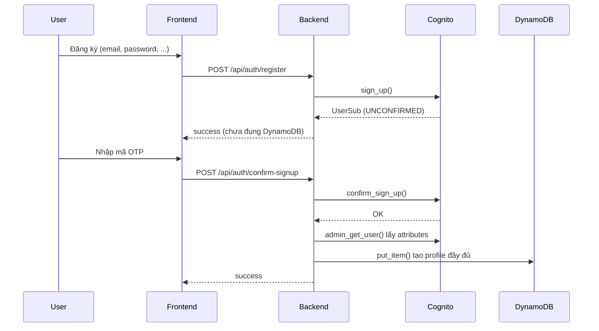
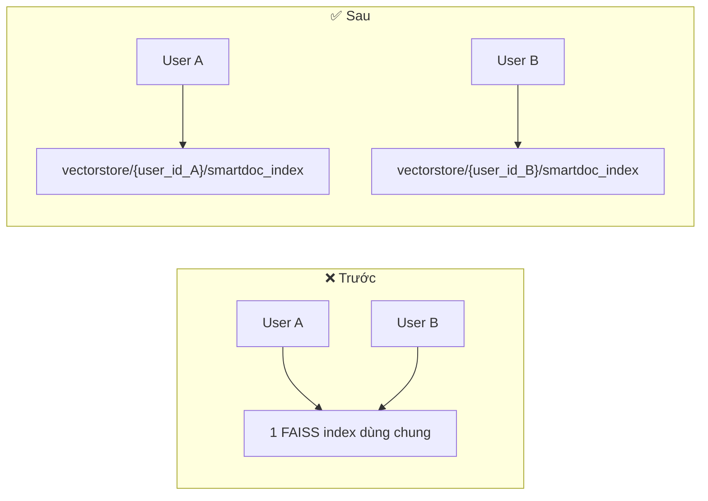
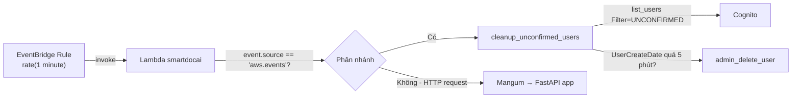

# Logs tổng hợp: Fix Multi-tenancy, Chat, Profile — SmartDocAI

**Ngày thực hiện:** 2026-07-15 → 2026-07-16
**Phạm vi:** Backend (`app_api.py`, `modules/*.py`), Frontend (`authSlice.js`, `cognito.js`), Hạ tầng AWS (Lambda, EventBridge, IAM)

---

## Mục lục

1. [Bối cảnh & vấn đề ban đầu](#1-bối-cảnh--vấn-đề-ban-đầu)
2. [Luồng đăng ký/xác thực mới (Hướng B)](#2-luồng-đăng-kýxác-thực-mới-hướng-b)
3. [Bug Multi-tenancy: dữ liệu lẫn giữa các user](#3-bug-multi-tenancy-dữ-liệu-lẫn-giữa-các-user)
4. [Bug phiên đăng nhập bị lẫn giữa các tab trình duyệt](#4-bug-phiên-đăng-nhập-bị-lẫn-giữa-các-tab-trình-duyệt)
5. [Bug Duplicate ids khi upload file thứ 2+](#5-bug-duplicate-ids-khi-upload-file-thứ-2)
6. [Bug CORS che giấu lỗi 500 thật](#6-bug-cors-che-giấu-lỗi-500-thật)
7. [Bug bộ lọc file bị bỏ qua ở Self-RAG/Co-RAG](#7-bug-bộ-lọc-file-bị-bỏ-qua-ở-self-ragco-rag)
8. [Bug câu hỏi tiếp nối (follow-up) bị lặp trong lịch sử](#8-bug-câu-hỏi-tiếp-nối-follow-up-bị-lặp-trong-lịch-sử)
9. [Bug cập nhật thông tin cá nhân (400 error)](#9-bug-cập-nhật-thông-tin-cá-nhân-400-error)
10. [Tự động dọn dẹp user chưa xác thực (EventBridge)](#10-tự-động-dọn-dẹp-user-chưa-xác-thực-eventbridge)
11. [Kiến trúc lưu trữ profile: Cognito vs DynamoDB](#11-kiến-trúc-lưu-trữ-profile-cognito-vs-dynamodb)
12. [⚠️ Ghi chú & Lưu ý quan trọng](#12-️-ghi-chú--lưu-ý-quan-trọng)
13. [Quy trình build & deploy tham khảo](#13-quy-trình-build--deploy-tham-khảo)

---

## 1. Bối cảnh & vấn đề ban đầu

Ứng dụng SmartDocAI (RAG chatbot xử lý tài liệu PDF/DOCX) chạy trên kiến trúc serverless:
**React (Vite) → API Gateway → Lambda (FastAPI + Mangum) → Cognito + DynamoDB + S3 + Bedrock**

Vấn đề khởi điểm: user đăng ký xong không thấy profile trong DynamoDB, và sau đó phát hiện thêm hàng loạt bug nghiêm trọng về cách ly dữ liệu giữa các user (multi-tenancy).

---

## 2. Luồng đăng ký/xác thực mới (Hướng B)

### Trước đây (có vấn đề)
- `register_user()` tạo **cả** Cognito user **và** DynamoDB profile ngay lập tức, kèm `verification_pending_until` (timeout 5 phút)
- Cần APScheduler chạy nền để dọn user chưa xác thực → **không hoạt động trên Lambda** (mỗi request là 1 container mới, APScheduler khởi động rồi tắt ngay, job không bao giờ chạy)

### Sau khi sửa (Hướng B)


| | Trước | Sau (Hướng B) |
|---|---|---|
| Khi nào tạo DynamoDB profile | Ngay lúc `register` | Chỉ sau khi `confirm-signup` thành công |
| Cần cleanup job? | Có (APScheduler — không chạy được trên Lambda) | **Không cần** — user chưa verify chỉ tồn tại ở Cognito, không tốn DynamoDB |
| User bỏ ngang không verify | Rác trong DynamoDB (`email_verified=false`, timeout 5 phút) | Không có gì trong DynamoDB — sạch |

### Cơ chế tự hồi phục (Self-healing)
`GET /api/profile` gọi `ensure_user_profile()`: nếu DynamoDB chưa có profile (ví dụ do lỗi mạng giữa `confirm-signup`), tự động lấy attributes từ Cognito (`list_users(Filter='sub = "..."')`) và tạo lại profile — đảm bảo user luôn có profile ngay khi truy cập app dù bước tạo lúc `confirm-signup` có lỡ thất bại.

---

## 3. Bug Multi-tenancy: dữ liệu lẫn giữa các user

### Triệu chứng
- User A upload file A, User B upload file B → **User B thấy cả file A và B**, AI trả lời được cả 2
- User B bấm "Xóa tài liệu" → **User A cũng mất sạch dữ liệu** khi F5 lại trang

### Root cause
| Thành phần | Vấn đề |
|---|---|
| `state` dict (module-level global) | `raw_documents`, `processed_files`, `vector_store` dùng chung cho **mọi request trên cùng 1 Lambda container** (Lambda tái sử dụng container "warm" giữa nhiều user khác nhau) |
| FAISS vector store | Dùng chung 1 path cố định: `config.FAISS_INDEX_NAME` = `"smartdoc_index"` — không có `user_id` trong path, tất cả user đọc/ghi **cùng 1 file index** trên S3 |
| `/api/clear-documents` | Gọi `clear_vector_store()` **không có tham số** → xóa đúng cái index dùng chung đó → xóa sạch dữ liệu của **tất cả** user |
| `/api/upload-url` | S3 key: `uploads/{filename}` — không có `user_id` → 2 user upload trùng tên file sẽ **ghi đè lẫn nhau** |

### Fix



1. **`get_user_index_name(user_id)`** — tính path riêng: `f"{user_id}/{FAISS_INDEX_NAME}"`
2. **`get_documents_from_vector_store(vs)`** (mới, trong `vector_store.py`) — đọc lại Document gốc trực tiếp từ FAISS docstore (`vs.docstore._dict.values()`), **thay thế hoàn toàn** việc giữ `raw_documents` trong `state` toàn cục
3. **`_bm25_retriever_cache`**: đổi từ 1 biến global → `dict` keyed theo `user_id`
4. **Mọi endpoint tài liệu/chat** (`/api/process`, `/api/delete-document`, `/api/chat`, `/api/clear-documents`): dùng **biến cục bộ trong hàm**, load lại tươi mới từ S3/FAISS mỗi request — không còn phụ thuộc `state[...]` toàn cục cho dữ liệu người dùng
5. **`require_user_id()`**: raise `401` ngay nếu thiếu/sai token — đóng lỗ hổng "âm thầm dùng chung bucket global" khi token lỗi
6. **`/api/upload-url`**: S3 key đổi thành `uploads/{user_id}/{filename}`

### Verify (test thật với 2 user)
- Tạo 2 Cognito user thật, mỗi user upload 1 file riêng (nội dung có "mã số bí mật" khác nhau)
- `/api/files`: mỗi user chỉ thấy đúng file của mình
- `/api/chat`: hỏi về "mã số" của người kia → AI trả lời "không có trong tài liệu"
- User B xóa hết file → **User A vẫn còn nguyên** file + chat hoạt động bình thường (đúng kịch bản bug gốc)
- `/api/files` không token → trả `401` đúng

---

## 4. Bug phiên đăng nhập bị lẫn giữa các tab trình duyệt

### Triệu chứng
Mở 2 tab, login 2 user khác nhau → cả 2 tab đều thấy dữ liệu của **cùng 1 user** (người đăng nhập sau cùng).

### Root cause
`amazon-cognito-identity-js` mặc định lưu token vào **`localStorage`** — dùng chung cho **mọi tab cùng origin** (khác với `sessionStorage` — riêng theo từng tab). Tab 1 login User A, Tab 2 login User B → `localStorage` key `LastAuthUser` bị **ghi đè** thành User B → Tab 1 vô tình gửi JWT của User B khi gọi API, dù UI vẫn hiển thị tên User A.

### Fix (2 bước, thiếu bước 2 vẫn lỗi)
1. `cognito.js`: thêm `Storage: window.sessionStorage` vào `poolData` khi khởi tạo `CognitoUserPool`
2. **Quan trọng — dễ bị bỏ sót**: `authSlice.js`'s `login()` tự tạo `new CognitoUser({ Username, Pool: userPool })` — nhưng **`CognitoUser` không tự kế thừa `Storage` từ `Pool`**, phải truyền tường minh `Storage: userPool.storage`. Thiếu dòng này thì bước 1 vô nghĩa — token vẫn bị ghi vào `localStorage` mặc định.

### Verify
Dùng Playwright kiểm tra trực tiếp `localStorage`/`sessionStorage` sau khi login — xác nhận token nằm đúng trong `sessionStorage`, không còn ở `localStorage`.

---

## 5. Bug Duplicate ids khi upload file thứ 2+

### Triệu chứng
Upload file đầu tiên OK, nhưng khi user đã có ≥1 file và upload thêm file mới (≥2 chunks) → `500 Internal Server Error`, kèm CORS error hiển thị trên browser.

### Root cause
`FAISS.from_documents()` (LangChain) có logic:
```python
ids = [doc.id for doc in documents]
if any(ids):                 # chỉ cần 1 document có sẵn .id
    kwargs["ids"] = ids      # ép TẤT CẢ document dùng ids này — kể cả None!
```
Document cũ (lấy lại từ FAISS docstore) đã có sẵn `.id`; document mới (`split_documents()`) có `.id = None`. Khi trộn lẫn 2 nhóm → list `ids` có nhiều `None` → `len(ids) != len(set(ids))` → `ValueError: Duplicate ids found in the ids list.`

### Fix
`create_vector_store()` trong `vector_store.py`: reset `doc.id = None` cho **toàn bộ** document (cũ lẫn mới) trước khi gọi `FAISS.from_documents()` — để FAISS tự sinh UUID mới, duy nhất cho tất cả.

---

## 6. Bug CORS che giấu lỗi 500 thật

### Triệu chứng
Console trình duyệt báo `"blocked by CORS policy"` thay vì hiện lỗi 500 thật — gây khó debug (bug #5 ở trên ban đầu bị hiểu nhầm là lỗi CORS).

### Root cause
Starlette's `ServerErrorMiddleware` nằm **NGOÀI** `CORSMiddleware`. Khi có exception chưa được FastAPI bắt (unhandled), response 500 được tạo ra **không đi qua** `CORSMiddleware` → thiếu header `Access-Control-Allow-Origin` → trình duyệt hiểu nhầm thành lỗi CORS.

### Fix
Thêm `@app.exception_handler(Exception)` — bắt **mọi** exception chưa xử lý, trả về `JSONResponse(status_code=500, ...)` một cách tường minh. Vì đây là response bình thường (không phải exception bay ra ngoài), nó **sẽ đi qua** `CORSMiddleware` như bình thường.

> Đây là fix mang tính phòng ngừa lâu dài — áp dụng cho **mọi lỗi 500 trong tương lai**, không chỉ bug #5.

---

## 7. Bug bộ lọc file bị bỏ qua ở Self-RAG/Co-RAG

### Triệu chứng
Tick chọn 1 file cụ thể trong "Lọc tài liệu" → nếu bật **Self-RAG** hoặc **Co-RAG**, AI vẫn trả lời dựa trên **toàn bộ** tài liệu (kể cả file không được chọn), có khi trả lời "không có context" dù file được chọn có đủ thông tin.

### Root cause
`self_rag_pipeline()` và `co_rag_pipeline()` **hoàn toàn không có tham số `file_filter`** — chỉ pipeline RAG chuẩn (`ask_question()`) có áp dụng lọc.

### Fix
- `self_rag.py`: thêm `file_filter` param, áp dụng ngay sau bước retrieve chính **và** bước retrieve bổ sung (multi-hop)
- `co_rag.py`: thêm `file_filter` param, áp dụng cho **cả 3 agent** (Semantic FAISS / Keyword BM25 / Conceptual LLM) trước khi hợp nhất kết quả (consensus merge)
- `app_api.py`: truyền `state["active_file_filter"]` vào cả 2 lời gọi pipeline

### Verify
Test trực tiếp: bật Self-RAG, lọc đúng 1/3 file → nguồn trích dẫn chỉ còn đúng file đó, không còn lẫn 2 file kia.

---

## 8. Bug câu hỏi tiếp nối (follow-up) bị lặp trong lịch sử

### Triệu chứng
Hỏi câu hỏi mơ hồ tiếp nối ngữ cảnh trước đó (VD: "này thì sao?", "còn cái kia thì sao?") → AI trả lời "câu hỏi không rõ ràng", dù ngữ cảnh trước đó đủ để suy luận.

### Root cause
Trong `/api/chat`: câu hỏi hiện tại được `chat_history.append(user_msg)` **trước khi** truyền `chat_history` vào `ask_question()`. Khi hàm `_reformulate_question()` xây "LỊCH SỬ HỘI THOẠI" từ `chat_history`, câu hỏi hiện tại xuất hiện **2 lần**: 1 lần ở cuối lịch sử, 1 lần ở phần "CÂU HỎI" → LLM bị rối, không biết "này" tham chiếu tới gì (vì câu hỏi mơ hồ che mất câu trả lời trước đó cần dùng để suy luận).

### Fix
Giữ bản sao `history_before_current = list(chat_history)` **trước khi** append câu hỏi hiện tại. Dùng bản này cho `ask_question(chat_history=...)` (dùng để reformulate + hiển thị "LỊCH SỬ HỘI THOẠI" trong prompt). `chat_history` đầy đủ (có câu hỏi mới) vẫn dùng để lưu lại bình thường qua `save_chat_history()`.

---

## 9. Bug cập nhật thông tin cá nhân (400 error)

### Triệu chứng
Trang Profile → "Lưu thay đổi" → `400 Bad Request` trên `PUT /api/profile/personal-info`.

### Root cause
`update_personal_info()` gọi:
```python
cognito.admin_update_user_attributes(
    UserPoolId=COGNITO_USERPOOL_ID,
    Username=user_id,   # ❌ user_id = Cognito "sub", KHÔNG phải username thật
    ...
)
```
User Pool này dùng **email làm Username**, không phải `sub` → Cognito trả `UserNotFoundException` → bị bắt bởi `except Exception` chung → 400.

*(Đối chiếu: hàm `change_password()` trong cùng file làm đúng — nhận thêm `email` từ JWT claim để dùng làm Username.)*

### Fix
1. Thêm `extract_email_from_token()` (giống `extract_user_id_from_token()` nhưng lấy claim `email`)
2. Endpoint `/api/profile/personal-info` lấy thêm `current_username = extract_email_from_token(authorization)`
3. `update_personal_info()` nhận thêm param `current_username`, dùng nó làm `Username` khi gọi Cognito (thay vì `user_id`) — độc lập với `email` (giá trị MỚI muốn set), nên vẫn đúng ngay cả khi user đổi luôn cả email trong cùng lần cập nhật

### Verify
Test thật: đổi tên "Lê Nguyễn Nhật" → "Lê Nguyễn Nhật Tâm" — thành công, xác nhận cả Cognito (`name`) và DynamoDB (`fullname`) đều đồng bộ đúng.

---

## 10. Tự động dọn dẹp user chưa xác thực (EventBridge)

### Vấn đề
User đăng ký nhưng không verify → tồn tại vĩnh viễn trong Cognito ở trạng thái `UNCONFIRMED` (không hại gì, nhưng là "rác"). Muốn tự động xóa sau ~5 phút.

### Vì sao không dùng lại APScheduler
Lambda là serverless — mỗi invocation có thể là 1 container mới, không có tiến trình nền chạy liên tục. Cần dùng cơ chế **AWS-native**: EventBridge Scheduled Rule.

### Kiến trúc



### Triển khai
1. **`auth_service.py`**: hàm `cleanup_unconfirmed_users(max_age_minutes=5)` — `list_users(Filter='cognito:user_status = "UNCONFIRMED"')`, so sánh `UserCreateDate` (Cognito tự có sẵn, **không cần lưu thêm timestamp nào**) với `now`, xóa nếu quá hạn
2. **`app_api.py`**: đổi `handler` từ `Mangum(app)` trực tiếp → hàm phân nhánh:
   ```python
   def handler(event, context):
       if event.get("source") == "aws.events":
           return cleanup_unconfirmed_users(max_age_minutes=5)
       return _mangum_handler(event, context)
   ```
3. **AWS CLI**:
   - `aws events put-rule --schedule-expression "rate(1 minute)"`
   - `aws lambda add-permission` cho phép EventBridge invoke Lambda
   - `aws events put-targets` gắn Lambda vào rule

### Chi phí
Gần như **$0/tháng** — EventBridge scheduled invocation (~43.200 lần/tháng) nằm trong Free Tier của Lambda (1 triệu request miễn phí), Cognito Admin API không tính vào MAU, CloudWatch Logs không đáng kể.

### Verify
- Invoke thủ công 1 lần trước khi tạo rule → dọn sạch **11 user test tồn đọng** từ suốt quá trình làm việc trước đó (side-effect tốt)
- Đăng ký 1 user test mới → chờ 6 phút → **xác nhận đã tự động bị xóa** khỏi Cognito

---

## 11. Kiến trúc lưu trữ profile: Cognito vs DynamoDB

| Thao tác | Nguồn |
|---|---|
| **Load** (`GET /api/profile`) | DynamoDB trước (nhanh, có đủ field mở rộng: avatar, subscription, quota, preferences...). Nếu thiếu → tự tạo lại từ Cognito (self-healing) |
| **Update** (`PUT /api/profile/personal-info`) | **Cognito trước** (nguồn xác thực chính) → **DynamoDB sau** (cache/mirror). Nếu Cognito fail → dừng ngay, không đụng DynamoDB. Nếu DynamoDB fail → chỉ log warning, không fail cả request (lần load sau sẽ tự đồng bộ lại) |

**Vì sao không đọc thẳng Cognito mỗi lần load:**
1. Cognito **không lưu** các field mở rộng của app (avatar, quota, subscription, preferences) — chỉ có DynamoDB mới có
2. DynamoDB `get_item` nhanh hơn nhiều (single-digit ms) so với gọi Cognito Admin API, và **không bị rate-limit** như Cognito Admin API

---

## 12. ⚠️ Ghi chú & Lưu ý quan trọng

### 🔴 Cognito User Pool này dùng EMAIL làm Username, KHÔNG phải `sub`
Đây là nguồn gốc của **2 bug riêng biệt** (self-healing profile, update personal-info). Bất kỳ lúc nào gọi Cognito Admin API (`admin_get_user`, `admin_update_user_attributes`, `admin_set_user_password`, `admin_delete_user`...) với tham số `Username`, **phải dùng email**, không phải `user_id`/`sub`. Nếu chỉ có `sub` (VD: lấy từ JWT), dùng `list_users(Filter='sub = "..."')` để tra ra email/username thật trước.

### 🔴 `CognitoUser` không tự kế thừa `Storage` từ `CognitoUserPool`
Phải truyền tường minh `Storage: userPool.storage` mỗi khi tự tạo `new CognitoUser({...})` thủ công. Đây là bug rất dễ tái diễn nếu sau này thêm flow mới (VD: forgot password) mà quên dòng này.

### 🔴 Lambda + Docker: 2 vấn đề build hay gặp
1. **Docker BuildKit cache "dính"**: đôi khi build image mới nhưng code cũ vẫn chạy trên Lambda (do cache layer COPY không invalidate đúng) → luôn kiểm tra log CloudWatch xem có message/code không tồn tại trong source hiện tại không, nếu có → rebuild với `--no-cache`
2. **Manifest format**: `docker buildx` (mặc định trên Docker Desktop mới) tạo OCI manifest — Lambda **không hỗ trợ**, chỉ nhận Docker V2 manifest. Luôn set `$env:DOCKER_BUILDKIT="0"` trước khi build để dùng legacy builder

### 🔴 State toàn cục trong Lambda container KHÔNG an toàn cho dữ liệu multi-user
Lambda tái sử dụng container ("warm") giữa các request của **user khác nhau**. Bất kỳ biến module-level nào giữ dữ liệu người dùng (không phải config/setting chung) đều có nguy cơ rò rỉ giữa các user. Luôn load fresh theo `user_id` trong từng request, không dựa vào cache toàn cục cho dữ liệu nhạy cảm.

### 🟡 Settings (Self-RAG/Hybrid/Co-RAG toggle...) vẫn đang GLOBAL — chưa fix
Đây là vấn đề **đã biết nhưng cố ý để sau** (theo quyết định của user). Không lộ dữ liệu, nhưng User A bật Self-RAG sẽ ảnh hưởng luôn User B do dùng chung 1 file `search_config.json`. Cần fix nếu muốn hoàn thiện multi-tenancy 100%.

### 🟡 ECR token hết hạn sau ~12 giờ
Nếu `docker push` báo lỗi `403 Forbidden`, chạy lại `aws ecr get-login-password | docker login ...` trước khi thử lại.

### 🟡 FastAPI CORSMiddleware + exception chưa bắt
Đã fix bằng global exception handler (mục 6), nhưng cần nhớ: **mọi route mới** thêm sau này vẫn nên tự bắt exception cụ thể để trả lỗi có ý nghĩa, tránh phụ thuộc hoàn toàn vào handler chung (chỉ nên là lưới an toàn cuối cùng).

### 🟡 PowerShell: lệnh nhiều dòng đôi khi bị cắt xén khi hiển thị
Không phải bug thật — chỉ là quirk hiển thị của terminal khi dùng lệnh nhiều dòng (multi-line). Ưu tiên nối lệnh bằng `;` trên 1 dòng khi cần đọc chính xác output.

---

## 13. Quy trình build & deploy tham khảo

```powershell
# 1. Build (LUÔN dùng legacy builder — Lambda không hỗ trợ OCI manifest)
$env:DOCKER_BUILDKIT="0"
docker build -t smartdocai:latest -f "<path>\backend\Dockerfile" "<path>\backend"

# 2. Nếu ECR token hết hạn (lỗi 403 khi push)
aws ecr get-login-password --region us-east-1 | docker login --username AWS --password-stdin 623035187993.dkr.ecr.us-east-1.amazonaws.com

# 3. Tag & Push
docker tag smartdocai:latest 623035187993.dkr.ecr.us-east-1.amazonaws.com/smartdocai:latest
docker push 623035187993.dkr.ecr.us-east-1.amazonaws.com/smartdocai:latest

# 4. Deploy lên Lambda
aws lambda update-function-code --function-name smartdocai --image-uri 623035187993.dkr.ecr.us-east-1.amazonaws.com/smartdocai:latest --region us-east-1

# 5. Verify
aws lambda get-function --function-name smartdocai --region us-east-1 | ConvertFrom-Json | Select-Object -ExpandProperty Configuration | Select-Object State, LastUpdateStatus
```

**Thông tin hạ tầng:**
- Lambda function: `smartdocai`
- API Gateway: `https://nxmlsvv3zk.execute-api.us-east-1.amazonaws.com/prod`
- Cognito User Pool: `us-east-1_3oq5wIiuu` (Client ID: `63f74h4dj78kqihhoimv4acl8a`)
- DynamoDB table: `smartdocai-user-profiles`
- S3 bucket: `smartdocai-storage-623035187993`
- EventBridge Rule (cleanup): `smartdocai-cleanup-unconfirmed-users` — `rate(1 minute)`
