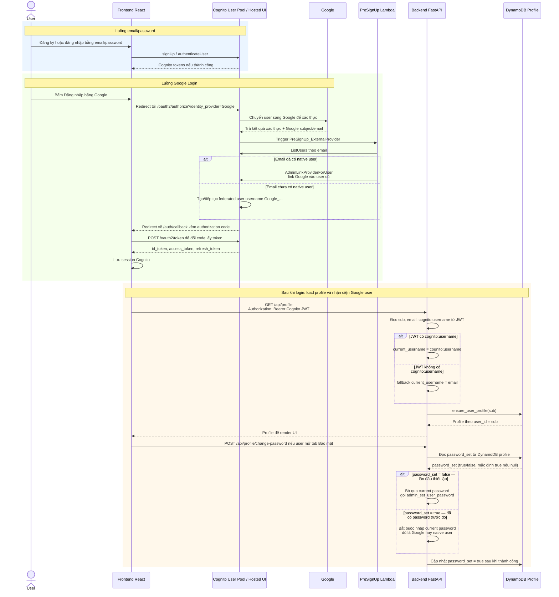

# Kịch bản trình bày: Google Login + Cognito Account Linking

> File local để chuẩn bị họp và share màn hình. Không commit/push file này.

## 0. Sơ đồ demo nhanh, mở file là thấy **Core**

**Nói trong 30 giây:**

User thao tác trên frontend, nhưng phần xác thực chính đi qua Cognito. Với email/password thì frontend gọi Cognito trực tiếp. Với Google login thì frontend redirect sang Cognito Hosted UI, Cognito nói chuyện với Google, rồi Cognito trả code về frontend. Sau khi frontend đổi code lấy Cognito token, mọi API như load profile đều gọi backend bằng `Authorization: Bearer Cognito JWT`.

**Mở khi share màn hình:**

- Show sơ đồ ngay dưới đây trong Markdown Preview.
- Sau đó bấm nhanh vào [smart-docs-ai/smart-docs-ai/src/api/cognitoOAuth.js](smart-docs-ai/smart-docs-ai/src/api/cognitoOAuth.js) để chỉ phần tạo URL và đổi code lấy token.
- Nếu cần nói về linking, bấm thẳng [backend/lambdas/presignup_check/lambda_function.py](backend/lambdas/presignup_check/lambda_function.py#L67).



**Chỉ vào khi nói:**

- Frontend gọi Cognito ở luồng login/register, còn frontend gọi backend sau khi đã có Cognito token.
- Cognito là bên gọi Google trong Google Login, không phải backend.
- PreSignUp Lambda chạy bên trong luồng Cognito, trước khi Cognito hoàn tất federated sign-up.
- `AdminLinkProviderForUser` chỉ xảy ra khi email Google đã có native user.
- Backend load profile bằng `sub`, vì DynamoDB profile dùng `user_id = sub`.
- `Google_...` là Cognito username cho federated user; còn email vẫn nằm trong claim `email`.
- Khi backend cần gọi Cognito Admin API, backend lấy `current_username = cognito:username`; nếu claim này không có thì fallback sang `email`.
- Khi đổi/setup password, backend kiểm tra `cognito:username.startswith("Google_")` hoặc claim `identities` có provider Google để biết đây là Google/linked user.

## 0.1. Cách dùng file này

- Đọc theo thứ tự từ trên xuống khi chuẩn bị nói.
- Mỗi phần có:
  - **Nói:** nội dung nên nói trong buổi họp.
  - **Mở:** màn hình, file hoặc trang AWS nên mở khi share màn hình.
  - **Chỉ vào:** phần cụ thể cần highlight cho người nghe.
- Trong VS Code Markdown Preview, bấm vào các link file để nhảy thẳng tới dòng code liên quan.
- Nếu thời gian ngắn, chỉ trình bày các mục có nhãn **Core**.

## 1. Tóm tắt một câu **Core**

**Nói:**

Hôm nay mình trình bày tổng thể luồng Google Login của SmartDocAI: frontend chuyển hướng sang Cognito Hosted UI như thế nào, Cognito xử lý Google như một identity provider ra sao, backend giữ profile gắn đúng với Cognito user như thế nào, và phần quan trọng nhất là dùng `AdminLinkProviderForUser` để một người dùng không bị tách thành nhiều account khi họ dùng cả Google và email/password.

**Mở:**

- Trang login trên browser:
  - `https://dutf3c70nnjzl.cloudfront.net/login`
  - hoặc `http://localhost:5173/login`

**Chỉ vào:**

- Nút `Đăng nhập bằng Google`.
- Nói thêm: nút này không tự xác thực Google ở frontend; nó bắt đầu luồng OAuth qua Cognito Hosted UI.

## 2. Bối cảnh cho người chưa biết vấn đề **Core**

**Nói:**

Trước khi vào code, mình nói nhanh về mô hình authentication hiện tại.

Ứng dụng dùng AWS Cognito làm hệ thống định danh chính. Hiện có hai cách đăng nhập:

1. Đăng nhập bằng email/password.
2. Đăng nhập bằng Google thông qua Cognito Hosted UI.

Trong Cognito, hai luồng này tạo ra dạng username khác nhau:

- User email/password dùng email làm Cognito username.
- User Google thường có Cognito username dạng `Google_<provider-sub>`.

Trong app của mình, profile và dữ liệu người dùng được lưu theo Cognito `sub`, không lưu theo email. Vì vậy nếu Cognito tạo hai user khác nhau cho cùng một người, app sẽ nhìn họ như hai người dùng khác nhau.

**Mở:**

- AWS Console -> Cognito -> User pool `us-east-1_3oq5wIiuu` -> Users.

**Chỉ vào:**

- Native user có username giống email.
- Google user có username dạng `Google_...`.
- User đã link provider có thể có attribute `identities`.

## 3. Luồng Google Login tổng thể **Core**

**Nói:**

Ở mức tổng thể, Google Login chạy theo các bước sau:

1. Frontend tạo URL `/oauth2/authorize` của Cognito.
2. Cognito chuyển người dùng sang Google.
3. Google xác thực xong và chuyển lại về Cognito.
4. Cognito chuyển lại về frontend `/auth/callback` kèm authorization code.
5. Frontend đổi code lấy Cognito tokens và lưu session tương thích với Cognito.

**Mở:**

- File: [smart-docs-ai/smart-docs-ai/src/api/cognitoOAuth.js](smart-docs-ai/smart-docs-ai/src/api/cognitoOAuth.js)

**Chỉ vào:**

- `COGNITO_DOMAIN`
- `CLIENT_ID`
- `getRedirectUri()`
- `getGoogleLoginUrl()`
- `exchangeCodeForTokens()`
- `persistCognitoSession()`

**Nói:**

Frontend chỉ redirect người dùng sang Cognito. Cognito mới là bên nói chuyện với Google, nhận kết quả xác thực, rồi phát hành Cognito JWT cho app. Vì vậy backend không xử lý Google token trực tiếp, mà chỉ verify Cognito JWT như các luồng đăng nhập khác.

Lý do username/id trong Cognito có dạng `Google_abcd` là vì đây là federated user: Cognito tự ghép tên provider `Google` với subject/id mà Google trả về. Email vẫn là email của user, nhưng Cognito username thật là `Google_...`.

## 4. Rủi ro chính: một người nhưng hai account **Core**

**Nói:**

Rủi ro lớn nhất không chỉ là Google login có chạy được hay không. Rủi ro lớn hơn là duplicate account.

Ví dụ:

- User đăng ký bằng `email@example.com` và có Cognito sub A.
- Sau đó cùng người đó đăng nhập Google bằng đúng email này.
- Nếu mình không xử lý, Cognito có thể tạo thêm user `Google_123...` với sub B.

Trong app, profile, tài liệu, lịch sử chat, quota và dữ liệu vector đều gắn theo Cognito `sub`. Vì vậy sub A và sub B sẽ giống như hai tài khoản app khác nhau.

**Mở:**

- File: [backend/modules/profile_service.py](backend/modules/profile_service.py)

**Chỉ vào:**

- `ensure_user_profile(user_id)` nếu đang thấy trên màn hình.
- Giải thích rằng `user_id` chính là Cognito `sub`.

**Có thể mở thêm:**

- AWS Console -> DynamoDB -> table `smartdocai-user-profiles`.

**Chỉ vào:**

- Partition key: `user_id`.

## 5. Giải pháp: AdminLinkProviderForUser **Core**

**Nói:**

Giải pháp là link Google identity vào Cognito user đã tồn tại, trước khi Cognito tạo ra một user Google riêng biệt.

Mình xử lý việc này trong Cognito PreSignUp Lambda trigger bằng API `AdminLinkProviderForUser`.

Luồng mới:

1. Google login kích hoạt trigger `PreSignUp_ExternalProvider`.
2. Lambda đọc email từ request Cognito gửi vào.
3. Lambda gọi `ListUsers` trong user pool để tìm user có email đó.
4. Nếu có native user mà username bằng email, Lambda link Google vào native user đó.
5. Lambda set `autoConfirmUser` và `autoVerifyEmail`.
6. Cognito tiếp tục luồng login nhưng không tạo một app identity riêng cho cùng người dùng.

**Mở:**

- Mở thẳng dòng quan trọng nhất: [backend/lambdas/presignup_check/lambda_function.py](backend/lambdas/presignup_check/lambda_function.py#L67)
- Nếu muốn trình bày từ đầu handler, mở: [backend/lambdas/presignup_check/lambda_function.py](backend/lambdas/presignup_check/lambda_function.py#L29)

**Chỉ vào:**

- Nhánh trigger Google: [backend/lambdas/presignup_check/lambda_function.py](backend/lambdas/presignup_check/lambda_function.py#L54)
- Đoạn tìm user theo email: [backend/lambdas/presignup_check/lambda_function.py](backend/lambdas/presignup_check/lambda_function.py#L58)
- Đoạn xác định native user: [backend/lambdas/presignup_check/lambda_function.py](backend/lambdas/presignup_check/lambda_function.py#L62)
- Dòng link Google vào user cũ, đây là dòng quan trọng nhất: [backend/lambdas/presignup_check/lambda_function.py](backend/lambdas/presignup_check/lambda_function.py#L67)
- Đoạn auto-confirm và auto-verify: [backend/lambdas/presignup_check/lambda_function.py](backend/lambdas/presignup_check/lambda_function.py#L84)

**Giải thích rõ `AdminLinkProviderForUser`:**

Khi Google trả về email đã xác thực, Cognito chuẩn bị tạo hoặc sử dụng một federated identity. Ngay lúc đó, PreSignUp Lambda kiểm tra xem email này đã thuộc về native Cognito user nào chưa.

Nếu có, `AdminLinkProviderForUser` nói với Cognito ba thông tin chính:

- Destination user: Cognito user đã tồn tại, thường là native user có username bằng email.
- Source provider: Google.
- Source provider user id: Google subject nằm trong username dạng `Google_...`.

Sau khi link, Google trở thành một cách đăng nhập khác cho account Cognito cũ, thay vì tạo một account app mới.

**Nói khi đang chỉ vào code:**

Đây là thay đổi cốt lõi. Thay vì chặn Google login hoặc để Cognito tạo duplicate user, mình gắn Google provider vào user đã tồn tại.

**Mở AWS:**

- AWS Console -> Lambda -> `smartdocai-presignup-check`.

**Chỉ vào trên AWS:**

- Function name: `smartdocai-presignup-check`.
- Runtime: `python3.12`.
- Handler: `lambda_function.lambda_handler`.

## 6. IAM permission cho trigger **Core**

**Nói:**

Để trigger này hoạt động, Lambda role cần quyền tìm user và link provider trong Cognito.

Các quyền đã thêm:

- `cognito-idp:ListUsers`
- `cognito-idp:AdminLinkProviderForUser`

**Mở:**

- AWS Console -> IAM -> Roles -> `smartdocai-presignup-role`.
- Permissions -> inline policy.

**Chỉ vào:**

- `ListUsers`.
- `AdminLinkProviderForUser`.
- Resource được scope vào user pool `us-east-1_3oq5wIiuu`.

**Nói:**

Permission này không mở rộng toàn bộ Cognito, mà được giới hạn vào đúng user pool cần dùng.

## 7. Backend: email không phải lúc nào cũng là Cognito username **Core**

**Nói:**

Một thay đổi quan trọng ở backend là phải tách rõ ba khái niệm:

- `sub`: ID ổn định của Cognito user, dùng làm `user_id` trong app.
- `email`: email để hiển thị hoặc liên hệ.
- `cognito:username`: username thật mà Cognito Admin API cần.

Với native user, email và username thường giống nhau. Với Google user, hai giá trị này không giống nhau.

**Mở:**

- File: [backend/app_api.py](backend/app_api.py)

**Chỉ vào:**

- `extract_user_id_from_token()`
- `extract_email_from_token()`
- `extract_cognito_username_from_token()`
- Endpoint update profile dùng `current_username = extract_cognito_username_from_token(...)`.

**Nói:**

Thay đổi này giúp các backend call như update profile hoặc setup password không dùng nhầm email trong khi Cognito thật ra cần username dạng `Google_...`.

## 8. Google-only user thiết lập password **Core**

**Nói:**

Google-only user ban đầu không có native password. Vì vậy tab Bảo mật không nên bắt họ nhập mật khẩu hiện tại ở lần thiết lập đầu tiên.

Mình đổi UI và backend flow để Google user thấy luồng `Thiết lập mật khẩu`, thay vì form đổi mật khẩu thông thường.

**Mở:**

- File: [smart-docs-ai/smart-docs-ai/src/features/profile/components/SecurityTab.jsx](smart-docs-ai/smart-docs-ai/src/features/profile/components/SecurityTab.jsx)

**Chỉ vào:**

- Logic nhận diện Google/linked user.
- Field mật khẩu hiện tại được ẩn với Google user.
- Button/text đổi thành `Thiết lập mật khẩu`.

**Mở backend:**

- File: [backend/modules/profile_service.py](backend/modules/profile_service.py)

**Chỉ vào:**

- `change_password(...)`
- `current_password: Optional[str]`
- `is_google_user`
- `admin_set_user_password(...)`

**Nói:**

Lần đầu setup password không yêu cầu current password vì user chưa từng có password native.

## 9. Đăng nhập lại bằng email/password sau khi set password **Core**

**Nói:**

Sau khi Google user set password, có một chi tiết Cognito cần xử lý: user pool hiện tại không bật email alias.

Điều đó nghĩa là Cognito vẫn cần username thật, ví dụ `Google_100...`, chứ không tự map từ email sang username. Native user vẫn login bằng email được vì username của họ chính là email.

Mình thêm fallback login flow:

1. Frontend thử login bằng email/password như bình thường.
2. Nếu Cognito trả `UserNotFoundException`, frontend hỏi backend username thật của email này là gì.
3. Backend trả về `Google_...` nếu email đó thuộc về Google user.
4. Frontend retry login bằng username đã resolve và password cũ user vừa nhập.

**Mở:**

- File: [smart-docs-ai/smart-docs-ai/src/store/slices/authSlice.js](smart-docs-ai/smart-docs-ai/src/store/slices/authSlice.js)

**Chỉ vào:**

- `authenticateWithUsername(...)`
- `login(...)`
- Catch `UserNotFoundException`.
- POST `/api/auth/resolve-login-username`.
- Retry bằng username backend trả về.

**Mở backend:**

- File: [backend/app_api.py](backend/app_api.py)

**Chỉ vào:**

- Endpoint `POST /api/auth/resolve-login-username`.

**Mở service:**

- File: [backend/modules/auth_service.py](backend/modules/auth_service.py)

**Chỉ vào:**

- `resolve_login_username_by_email(email)`.
- `list_users(Filter=email)`.
- Ưu tiên native user, fallback sang federated user.

**Nói:**

Mình chọn cách này thay vì đổi cấu hình user pool sang email alias, vì alias setting là thay đổi ở tầng identity và có thể ảnh hưởng user hiện tại.

## 10. Hosted UI callback URL / CloudFront **Core**

**Nói:**

Cognito Hosted UI yêu cầu mọi redirect URI phải được allowlist rõ ràng.

Frontend local dùng localhost, còn frontend deploy dùng CloudFront. Nếu callback URL của CloudFront bị thiếu, Cognito sẽ báo `Login pages unavailable` với lỗi `redirect_mismatch`.

**Mở:**

- AWS Console -> Cognito -> User pool `us-east-1_3oq5wIiuu`.
- App integration -> App client `ReactAppClient`.
- Managed login pages / Hosted UI config.

**Chỉ vào:**

Allowed callback URLs nên có:

```text
https://dutf3c70nnjzl.cloudfront.net/auth/callback
```

Allowed sign-out URLs nên có:

```text
https://dutf3c70nnjzl.cloudfront.net/login
```

**Nói:**

Phần này là cấu hình AWS, không phải lỗi backend. Mỗi frontend domain mới đều cần được thêm vào Cognito App Client.

## 11. Validate và deploy **Core**

**Nói:**

Mình validate theo ba lớp: local build, AWS trigger, và production deployment.

**Mở terminal hoặc nhắc lại:**

```powershell
C:/msys64/ucrt64/bin/python.exe -m py_compile backend/app_api.py backend/modules/auth_service.py backend/modules/profile_service.py
npm run build
```

**Chỉ vào:**

- Python compile pass.
- Frontend build pass.

**Mở AWS:**

- CodePipeline -> `smartdocai-be-pipeline`.

**Chỉ vào:**

- Latest execution succeeded.
- Build stage succeeded.

**Mở Lambda:**

- Lambda -> `smartdocai`.
- Lambda -> `smartdocai-presignup-check`.

**Chỉ vào:**

- State `Active`.
- LastUpdateStatus `Successful`.

## 12. Lộ trình share màn hình nhanh

Nếu buổi họp ngắn, đi theo thứ tự này:

1. **Browser login page**
   - Show nút Google login.
   - Giải thích nó bắt đầu luồng Cognito Hosted UI.

2. **[smart-docs-ai/smart-docs-ai/src/api/cognitoOAuth.js](smart-docs-ai/smart-docs-ai/src/api/cognitoOAuth.js)**
   - Show authorize URL và callback logic.

3. **[backend/lambdas/presignup_check/lambda_function.py](backend/lambdas/presignup_check/lambda_function.py#L67)**
   - Show `AdminLinkProviderForUser`.

4. **AWS Lambda `smartdocai-presignup-check`**
   - Show function/trigger đã deploy.

5. **AWS IAM role `smartdocai-presignup-role`**
   - Show `ListUsers` và `AdminLinkProviderForUser`.

6. **[backend/app_api.py](backend/app_api.py)**
   - Show `extract_cognito_username_from_token` và endpoint resolve username.

7. **[smart-docs-ai/smart-docs-ai/src/features/profile/components/SecurityTab.jsx](smart-docs-ai/smart-docs-ai/src/features/profile/components/SecurityTab.jsx)**
   - Show UI thiết lập password cho Google user.

8. **Cognito App Client Hosted UI config**
   - Show callback URL CloudFront.

9. **CodePipeline**
   - Show deploy succeeded.

## 13. Demo flow nếu còn thời gian

### Demo A: Google Login

**Mở:** Browser login page.

Các bước:

1. Bấm `Đăng nhập bằng Google`.
2. Redirect qua Cognito/Google.
3. Quay lại app.

**Nói:**

Đây là phần người dùng nhìn thấy. Phía sau, Cognito cấp JWT và frontend lưu Cognito session.

### Demo B: Google user thiết lập password

**Mở:** Profile -> Bảo mật.

Các bước:

1. Login bằng Google user.
2. Mở tab Bảo mật.
3. Show `Thiết lập mật khẩu`.
4. Set password.
5. Logout.
6. Login lại bằng email/password.

**Nói:**

Demo này cho thấy user có thể đi từ Google-only login sang password login.

### Demo C: Cấu hình callback URL

**Mở:** Cognito App Client Hosted UI config.

**Nói:**

Nếu callback URL này thiếu, app sẽ gặp `redirect_mismatch`. Vì vậy mỗi domain frontend deploy đều phải được đăng ký trong Cognito.

## 14. Trade-off và giới hạn

### 14.1. Không bật email alias

**Nói:**

Mình không đổi user pool sang email alias vì đây là thay đổi lớn ở tầng identity. Thay vào đó, mình thêm username resolution ở app/backend layer.

### 14.2. Google user không trở thành native user hoàn toàn

**Nói:**

Sau khi set password, user vẫn có Google federated identity. Nên hiểu họ là linked/federated user có thêm password, không phải pure native user.

### 14.3. Các lần đổi password sau này

**Nói:**

Hiện tại Google user không cần current password khi setup/change. Về lâu dài nên thêm flag `password_set`. Sau lần setup đầu tiên, các lần đổi tiếp theo nên yêu cầu current password hoặc đi qua forgot-password flow.

## 15. Rủi ro còn lại / next steps

**Nói:**

Các việc nên làm tiếp:

1. Thêm `password_set` vào profile.
2. Làm forgot password/reset password flow.
3. Document callback URL theo từng environment.
4. Cleanup endpoint check-email cũ nếu team đồng ý.
5. Thêm automated test cho username resolver và linked Google password flow.

## 16. Q&A dự kiến

### Q: Vì sao cần `AdminLinkProviderForUser`?

**A:** Vì Cognito không tự merge native user và Google user chỉ vì chúng có cùng email. Nếu không link, một người có thể trở thành hai Cognito users khác nhau.

### Q: Cách này có giữ data cũ không?

**A:** Có. Mục tiêu là giữ lại Cognito `sub` cũ, vì data trong app được key theo `sub`.

### Q: Google user set password xong có trở thành native user không?

**A:** Không hoàn toàn. User vẫn là linked/federated user, nhưng có thêm password để authenticate qua Cognito.

### Q: Vì sao sau khi set password vẫn cần username resolver?

**A:** Vì user pool không bật email alias. Cognito cần username thật, còn Google username có dạng `Google_...`.

### Q: Lỗi `Login pages unavailable` do đâu?

**A:** Do thiếu callback URL trong Cognito App Client. Đây là vấn đề cấu hình Hosted UI.

### Q: Có ảnh hưởng normal email/password user không?

**A:** Native login vẫn dùng username=email. Các thay đổi chủ yếu thêm fallback cho Google/linked user.

## 17. Closing script

**Nói:**

Tóm lại, mình đã triển khai Google Login theo hướng an toàn hơn cho identity. Google có thể được link vào Cognito user đã tồn tại bằng `AdminLinkProviderForUser`, backend đã tách rõ email, sub và Cognito username, Google-only user có thể thiết lập password, và sau đó login bằng email/password thông qua username resolution.

Phần AWS cũng đã được xử lý: PreSignUp Lambda, IAM permission, Hosted UI callback URLs, và backend deployment qua CodePipeline. Phần nên làm tiếp là harden password lifecycle bằng `password_set` và forgot-password support.

## 18. Checklist trước khi share màn hình

- [ ] Mở browser login page.
- [ ] Mở sẵn các file trong VS Code:
  - [ ] [smart-docs-ai/smart-docs-ai/src/api/cognitoOAuth.js](smart-docs-ai/smart-docs-ai/src/api/cognitoOAuth.js)
  - [ ] [backend/lambdas/presignup_check/lambda_function.py](backend/lambdas/presignup_check/lambda_function.py#L67)
  - [ ] [backend/app_api.py](backend/app_api.py)
  - [ ] [backend/modules/auth_service.py](backend/modules/auth_service.py)
  - [ ] [backend/modules/profile_service.py](backend/modules/profile_service.py)
  - [ ] [smart-docs-ai/smart-docs-ai/src/store/slices/authSlice.js](smart-docs-ai/smart-docs-ai/src/store/slices/authSlice.js)
  - [ ] [smart-docs-ai/smart-docs-ai/src/features/profile/components/SecurityTab.jsx](smart-docs-ai/smart-docs-ai/src/features/profile/components/SecurityTab.jsx)
- [ ] Mở sẵn các tab AWS Console:
  - [ ] Cognito User Pool Users.
  - [ ] Cognito App Client Hosted UI config.
  - [ ] Lambda `smartdocai-presignup-check`.
  - [ ] IAM role `smartdocai-presignup-role`.
  - [ ] CodePipeline `smartdocai-be-pipeline`.
- [ ] Chuẩn bị đúng email test: `spixztworldwide@gmail.com`.
- [ ] Nếu demo CloudFront, xác nhận callback URL đã save.
- [ ] Nhắc team: log chi tiết nằm ở branch `phuc`, không nằm trên `main`.
